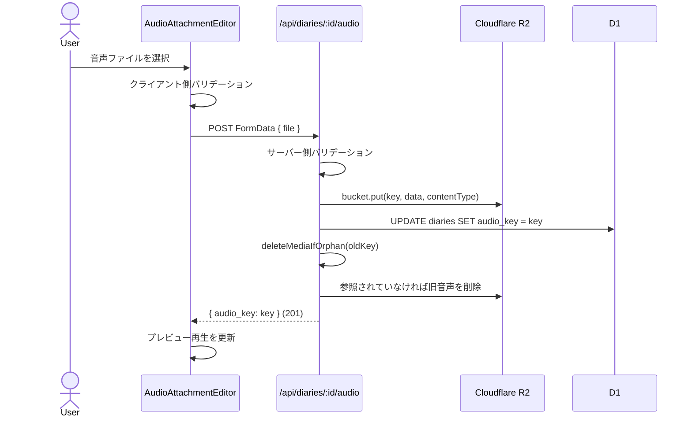
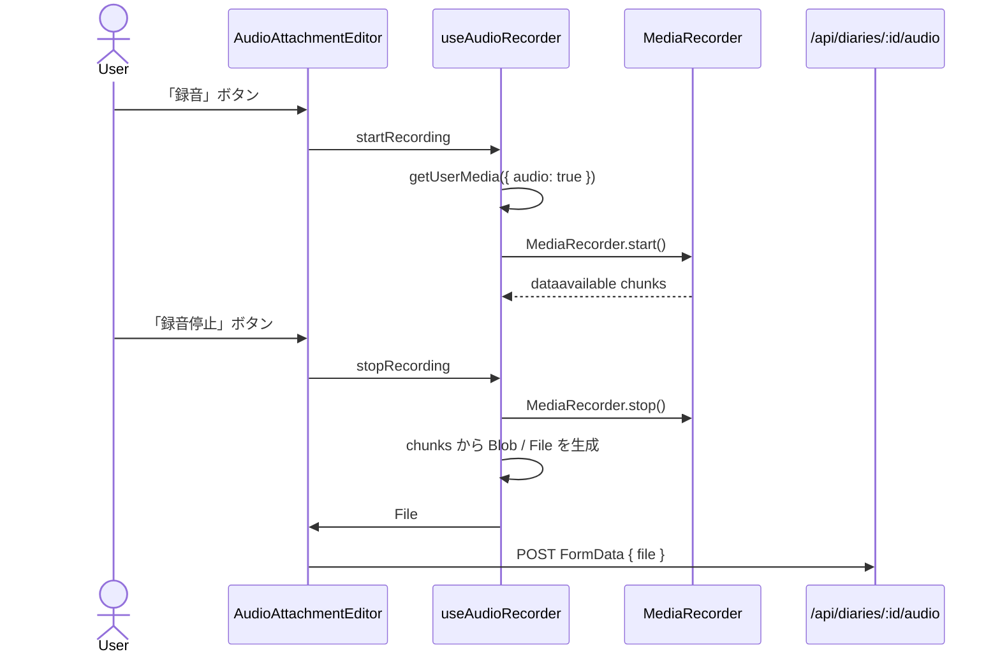
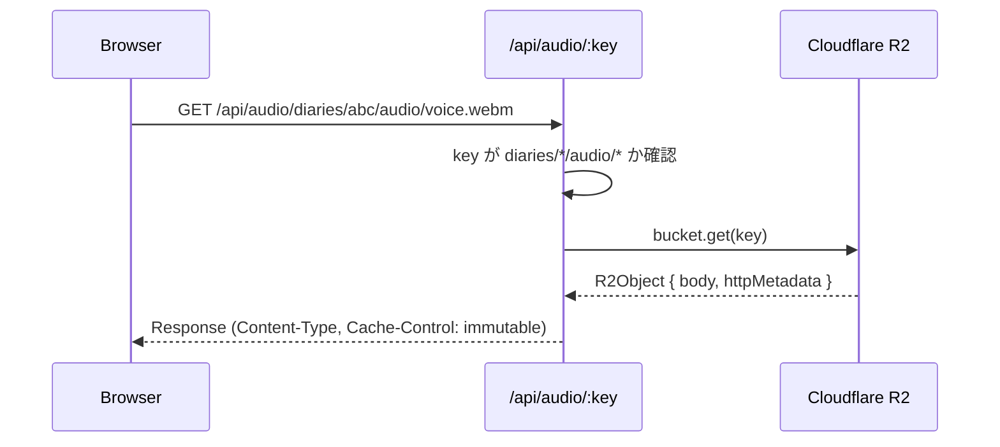
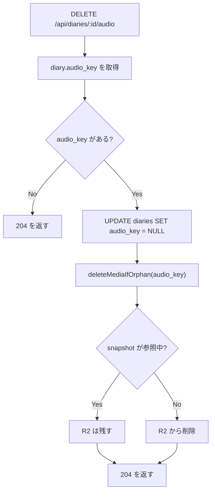
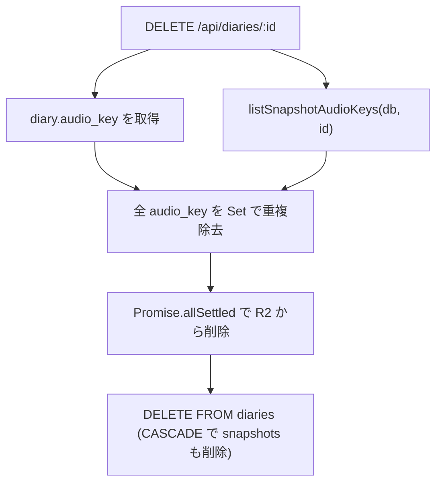

# 音声アップロード・録音・再生

## 概要

Cloudflare R2 を使った音声のアップロード・録音・配信・削除。日記1件につき音声1件を添付できる。編集画面では音声ファイルのアップロードとブラウザ録音に対応し、公開ページでは公開スナップショットに音声がある場合だけ「声で聞く」ボタンを表示する。

音声は本文とは同期しない。再生時間から本文位置を推定するだけではズレやすく、紙面の見た目にもノイズになりやすいため、ハイライトや下線など本文側の視覚表現は入れない。

## R2 ストレージ構成

```
R2 Bucket: 400-diary-images (画像と共有)
└── diaries/
    └── {diaryId}/
        └── audio/
            └── {timestamp}-{nanoid(8)}.{ext}
```

- キー生成: `diaries/${diaryId}/audio/${Date.now()}-${nanoid(8)}.${ext}`
- 音声の差し替え時は新しいキーを生成する
- 公開スナップショットが参照している古い音声は削除しない

例:

```
diaries/abc123/audio/1712345678-a1b2c3d4.mp3
diaries/abc123/audio/1712345678-a1b2c3d4.webm
```

## データモデル

音声キーは下書きと公開スナップショットの両方に保存する。

```sql
diaries.audio_key TEXT
diary_snapshots.audio_key TEXT
```

公開時は `publishDiary` が `diaries.audio_key` を `diary_snapshots.audio_key` にコピーする。これにより、公開後に下書き側の音声を変更・削除しても、公開ページでは公開時点の音声を再生し続ける。

## バリデーション

| チェック | 制限 | エラーメッセージ |
|---------|------|----------------|
| ファイル形式 | MP3, WebM, MP4, WAV, Ogg | 「MP3, WebM, MP4, WAV, Ogg のみアップロードできます」 |
| ファイルサイズ | 25MB以下 | 「音声は25MB以内にしてください」 |

クライアント側とサーバー側の両方でバリデーションする。録音時の MIME type は `audio/webm;codecs=opus` のように codec パラメータを含む場合があるため、判定と拡張子決定では `;` より前のベース MIME type を使用する。許可 MIME type、file input の accept 文字列、MIME → 拡張子マップは `app/lib/audio-mime.ts` に集約し、サーバー (`storage.ts`) とクライアント (`audio-attachment-editor.tsx` / `use-audio-recorder.ts`) の両方から参照する。

| MIME type | 拡張子 |
|-----------|--------|
| `audio/mpeg` | `mp3` |
| `audio/mp3` | `mp3` |
| `audio/webm` | `webm` |
| `audio/mp4` | `m4a` |
| `audio/wav` | `wav` |
| `audio/ogg` | `ogg` |

## 前提条件

音声アップロードは `POST /api/diaries/:id/audio` で日記IDを必要とするため、**日記を一度保存してからでないと音声を追加できない**。新規作成時はまず本文を保存し、その後に音声ファイルをアップロードまたは録音する。

## アップロードフロー



DB 更新は R2 アップロード後に行う。旧音声の R2 削除は `deleteMediaIfOrphan` 経由の best-effort で、削除に失敗してもレスポンスは成功のまま返す。

## 録音フロー



録音 MIME type はブラウザ対応状況に応じて選ぶ。

```ts
[
  'audio/webm;codecs=opus',
  'audio/webm',
  'audio/mp4',
  'audio/ogg;codecs=opus',
]
```

`MediaRecorder.isTypeSupported(type)` が true を返す最初の形式を使う。候補が使えない場合は MIME type を明示せず `MediaRecorder(stream)` を作り、生成された Blob の type を使う。

録音終了後は media track を停止する。コンポーネントのアンマウント時にも録音中なら停止し、マイクを解放する。

## 音声配信フロー



### 公開範囲

`/api/audio/:key` は次の形式だけを配信する。

```
diaries/{diaryId}/audio/{filename}
```

`fonts/`, `og/`, 画像キー、その他の内部オブジェクトはこのエンドポイントから露出しない。逆に `/api/images/:key` でも `diaries/{diaryId}/audio/*` は配信しない。

### キャッシュ戦略

```
Cache-Control: public, max-age=31536000, immutable
```

- 1年間キャッシュ
- `immutable`: 音声は変更されないキーで保存されるため安全
- 音声の差し替え時は新しいキーが生成される

## 公開ページの再生

公開ページ `/d/:id` は公開スナップショットの `audio_key` を使う。音声がある場合だけ、ヘッダー右側の操作エリアに `AudioPlayer` を表示する。

- 通常時: 「声で聞く」
- 再生中: 「停止」
- 認証済みの場合: 「声で聞く」は「編集する」の左隣に表示
- 未認証の場合: 右上に「声で聞く」だけ表示
- ネイティブ `<audio>` は非表示で、ボタン操作だけを表示

本文と音声の同期表示はしない。

## 削除フロー

### 音声の削除



DB 更新を先に行い、DB 更新に失敗した場合は R2 を削除しない。公開スナップショットが参照している音声も削除しない。

### 日記の削除時



画像と同じく、下書きの音声キーとスナップショットの音声キーを両方収集し、R2 のオーファン音声を防ぐ。

## 本文同期について

再生時間から本文全体の進行率を推定するだけのハイライトや下線は採用しない。読み上げの間、読み飛ばし、アドリブ、読み上げ速度の変化で簡単にズレるため。

将来実装する場合は、音声と本文の対応関係を明示的に持つ alignment metadata を別途設計する。

```json
[
  { "start": 0.0, "end": 1.2, "from": 0, "to": 8 },
  { "start": 1.2, "end": 2.4, "from": 8, "to": 17 }
]
```

この場合は、保存先、生成タイミング、再公開時のスナップショット固定、本文編集時の無効化ルールを決める必要がある。

## マイグレーション

新規 DB では `db/schema.sql` のテーブル定義に `audio_key` が含まれる。

既存 DB では migration ファイルを一度だけ適用する。

```sh
pnpm wrangler d1 execute 400-diary-db --local --file=db/migrations/20260509_0001_add_audio_key.sql
pnpm wrangler d1 execute 400-diary-db --remote --file=db/migrations/20260509_0001_add_audio_key.sql
```

## `storage.ts` の関数

| 関数 | 用途 |
|------|------|
| `validateAudio(size, type)` | 形式・サイズチェック |
| `generateAudioKey(diaryId, mime)` | R2 キー生成 |
| `uploadAudio(bucket, key, data, contentType)` | R2 へアップロード |
| `getAudio(bucket, key)` | R2 から取得 (body + contentType) |
| `deleteAudio(bucket, key)` | R2 から削除 |

## `db.ts` の関数

| 関数 | 用途 |
|------|------|
| `countSnapshotsWithAudioKey(db, audioKey)` | 音声キーを参照している snapshot 件数を返す |
| `listSnapshotAudioKeys(db, diaryId)` | 日記に紐づく snapshot の音声キー一覧を返す |
| `publishDiary(db, id)` | 下書きの `audio_key` を snapshot にコピーする |
| `updateDiary(db, id, { audio_key })` | 下書きの音声キーを更新・削除する |

## 関連ファイル

| ファイル | 役割 |
|---------|------|
| `db/schema.sql` | 新規DB向けのテーブル定義 |
| `db/migrations/20260509_0001_add_audio_key.sql` | 既存DB向けの `audio_key` 追加 migration |
| `app/lib/storage.ts` | R2 操作・音声バリデーション |
| `app/lib/audio-mime.ts` | 許可 MIME type、accept 文字列、MIME ベース型抽出、MIME → 拡張子マップ（クライアント/サーバー共有） |
| `app/lib/media-cleanup.ts` | snapshot 参照を考慮した R2 孤児削除 |
| `app/lib/use-audio-recorder.ts` | ブラウザ録音、MIME type 選択、media track cleanup |
| `app/lib/db.ts` | 音声キーの保存・公開コピー・参照確認 |
| `app/routes/api/diaries/[id]/audio.ts` | 音声アップロード・削除 API |
| `app/routes/api/audio/[...key].ts` | 音声配信エンドポイント |
| `app/routes/api/diaries/[id].ts` | 日記削除時の音声 R2 クリーンアップ |
| `app/islands/audio-attachment-editor.tsx` | アップロード・録音・削除 UI |
| `app/islands/vertical-editor.tsx` | 編集画面での音声 state の保持と子コンポーネントへの受け渡し |
| `app/islands/audio-player.tsx` | 公開ページの再生ボタン |
| `app/routes/d/[id].tsx` | 公開スナップショット音声の表示 |
