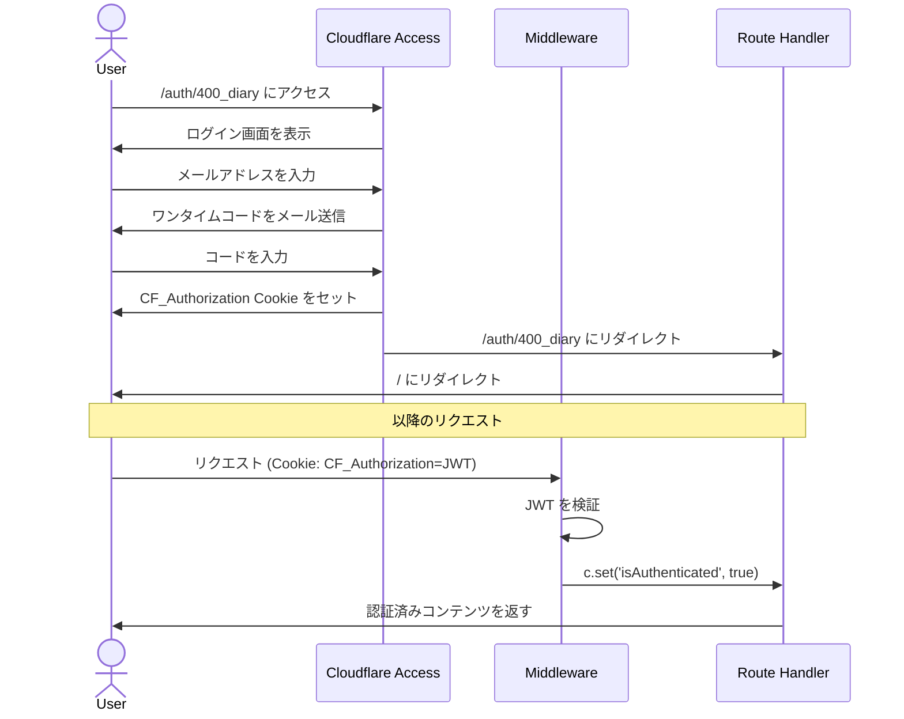
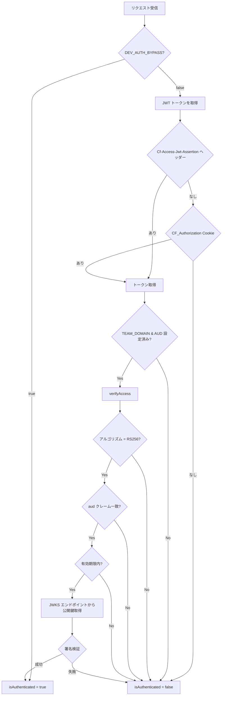
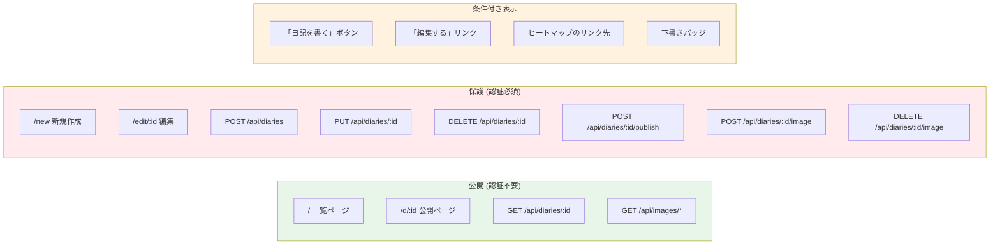

# Authentication

## Overview

Cloudflare Access の JWT を検証するミドルウェア方式。アプリ側にユーザー管理機能はなく、認証はCloudflareのインフラ層に委譲する。

## 認証フロー

## JWT 検証の詳細

## 認証の影響範囲

## 環境別の設定

| 環境 | 認証方式 | 設定 |
|------|---------|------|
| ローカル開発 | バイパス | `.dev.vars` に `DEV_AUTH_BYPASS=true` |
| 本番 | Cloudflare Access | `wrangler.toml` に `CF_ACCESS_TEAM_DOMAIN` と `CF_ACCESS_AUD` |

## JWKS キャッシュ

公開鍵は Cloudflare の JWKS エンドポイント (`https://{teamDomain}/cdn-cgi/access/certs`) から取得し、1時間キャッシュする。

## 関連ファイル

| ファイル | 役割 |
|---------|------|
| `app/routes/_middleware.ts` | 認証ミドルウェア |
| `app/lib/auth.ts` | JWT 検証ロジック (JWKS, 署名検証) |
| `app/factory.ts` | AppEnv 型定義 (Bindings, Variables) |
| `app/routes/auth/400_diary.tsx` | 認証エンドポイント (リダイレクトのみ) |
| `.dev.vars` | ローカル開発用設定 |
