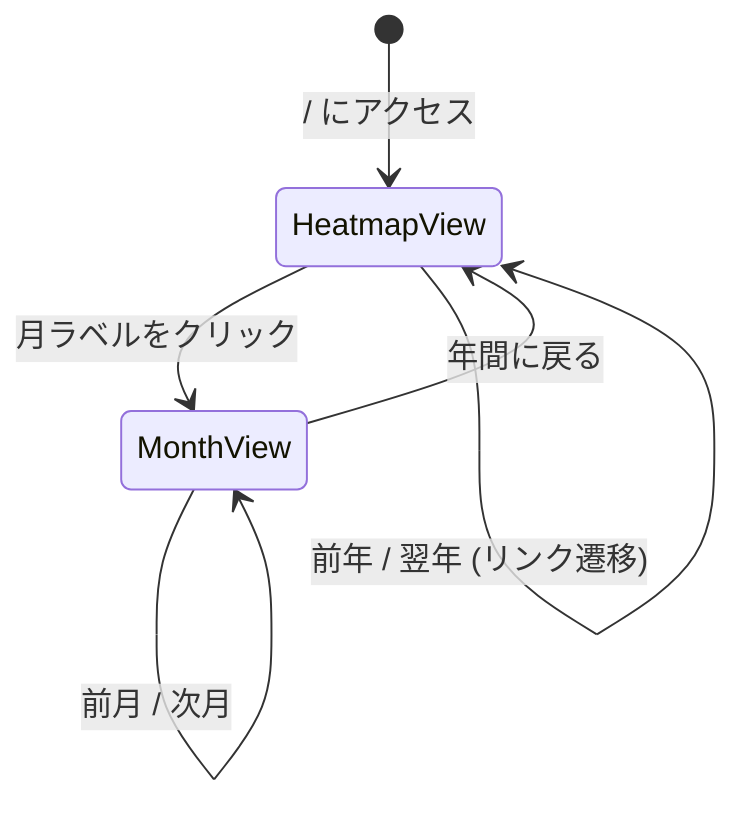
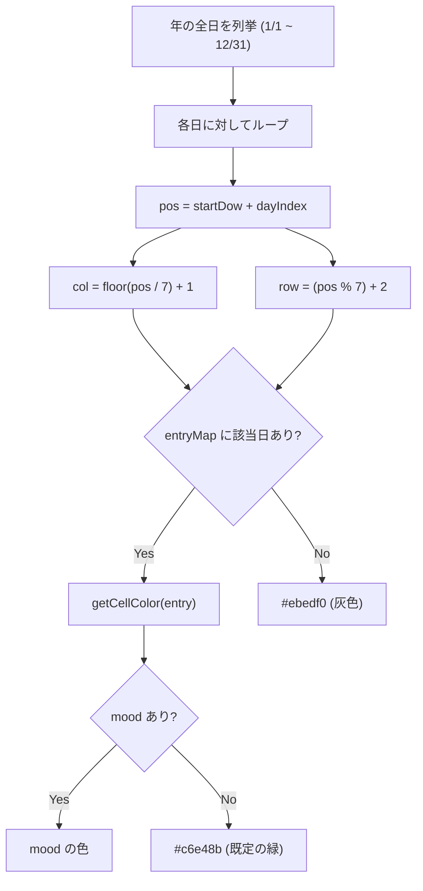
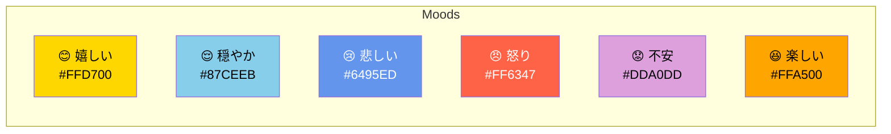
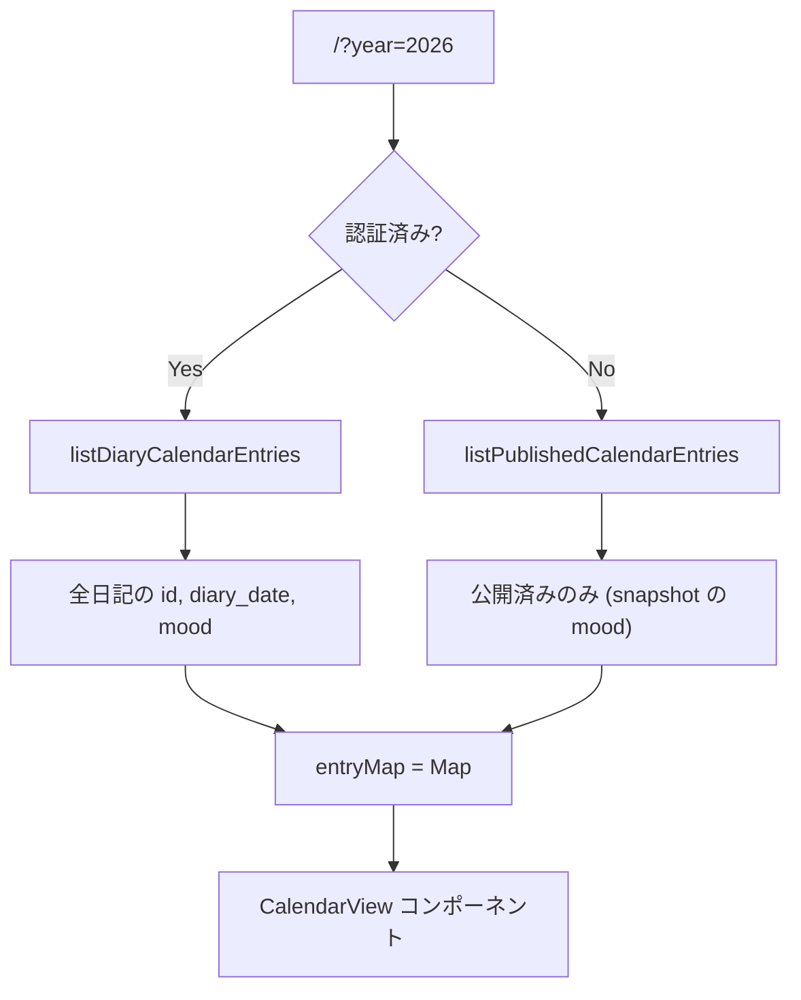

# Calendar & Heatmap

## Overview

GitHub 風のヒートマップと月間カレンダーの2つのビューで日記の執筆状況を可視化する。セルの色は mood（気分）に連動。

## 2つのビュー



## ヒートマップビュー

### 構造

```
  1月    2月    3月    ...                    12月
┌──┬──┬──┬──┬──┬──┬──┬──┬──┬──┬─────────────────┐
│  │  │  │  │  │  │  │  │  │  │ ...             │ 日
│  │  │  │  │  │  │  │  │  │  │                 │ 月
│  │  │  │  │  │  │  │  │  │  │                 │ 火
│  │  │  │  │  │  │  │  │  │  │                 │ 水
│  │  │  │  │  │  │  │  │  │  │                 │ 木
│  │  │  │  │  │  │  │  │  │  │                 │ 金
│  │  │  │  │  │  │  │  │  │  │                 │ 土
└──┴──┴──┴──┴──┴──┴──┴──┴──┴──┴─────────────────┘
← 横スクロール可能 (初期スクロール位置は表示年で決まる)
```

### CSS Grid レイアウト

```
gridTemplateRows: auto repeat(7, 12px)      ← 月ラベル行 + 7曜日行
gridTemplateColumns: repeat(52~53, 12px) 30px ← 週数 + 曜日ラベル列
gap: 2px
```

- セルサイズ: 12px × 12px
- 各セルは `gridRow` と `gridColumn` で明示的に配置
- 年の初日の曜日(`startDow`)でオフセットを計算

### セル配置アルゴリズム



## 月間カレンダービュー

```
        4月
日 月 火 水 木 金 土
         1  2  3  4
 5  6  7  8  9 10 11
12 13 14 15 16 17 18
19 20 21 22 23 24 25
26 27 28 29 30
```

- `gridTemplateColumns: repeat(7, 1fr)` の標準グリッド
- `firstDow` で月初の空白セルを挿入
- 日記のある日はリンク・mood 色つき、ない日はグレーテキスト

## Mood（気分）システム



| キー | ラベル | 絵文字 | 色 |
|------|--------|--------|------|
| `happy` | 嬉しい | 😊 | `#FFD700` (Gold) |
| `calm` | 穏やか | 😌 | `#87CEEB` (Sky Blue) |
| `sad` | 悲しい | 😢 | `#6495ED` (Cornflower Blue) |
| `angry` | 怒り | 😠 | `#FF6347` (Tomato) |
| `anxious` | 不安 | 😟 | `#DDA0DD` (Plum) |
| `fun` | 楽しい | 😆 | `#FFA500` (Orange) |

- エディタで6つの絵文字ボタンから選択（トグル式）
- 未選択なら `null`（ヒートマップでは既定の緑色）

## データフロー



### 認証別のデータ

| 認証状態 | 関数 | データソース | 表示対象 |
|---------|------|------------|---------|
| 認証済み | `listDiaryCalendarEntries` | `diaries` テーブル | 下書き含む全日記 |
| 未認証 | `listPublishedCalendarEntries` | `diaries JOIN diary_snapshots` | 公開済みのみ |

## リンク先

| 認証状態 | クリック先 |
|---------|-----------|
| 認証済み | `/edit/{id}` |
| 未認証 | `/d/{id}` |

## 年ナビゲーション

- `minYear` / `maxYear` は全日記の `diary_date` から算出
- 範囲外の年はボタンを非表示
- URL パラメータ `?year=YYYY` で年を指定

## レスポンシブ対応

- ヒートマップは横スクロール可能（`overflowX: auto`）
- `hide-scrollbar` クラスでスクロールバーを非表示
- PC（横スクロール余地が無い幅）ではヒートマップ全体がそのまま見えるため、初期スクロール処理は何もしない
- モバイル（横スクロール余地がある幅）では表示中の year に応じて初期スクロール位置を決める
  - 現在年: 現在月の列付近（`monthStartCols[currentMonth] * 14 - 4`px）
  - 過去年: 右端（12月、`scrollLeft = scrollWidth`）
  - 未来年: 左端（1月、`scrollLeft = 0`）
- 現在年・現在月は `toLocalDateString()`（JST）で判定
- スクロール位置決定ロジックは純粋関数として `app/lib/heatmap-scroll.ts` に切り出してテスト

## 関連ファイル

| ファイル | 役割 |
|---------|------|
| `app/islands/calendar-view.tsx` | CalendarView, HeatmapView, MonthView コンポーネント |
| `app/lib/heatmap-scroll.ts` | ヒートマップ初期スクロール位置を決める純粋関数 |
| `app/lib/mood.ts` | Mood 定義 (`MOODS`, `getMoodByKey`) |
| `app/lib/db.ts` | `listDiaryCalendarEntries`, `listPublishedCalendarEntries` |
| `app/routes/index.tsx` | カレンダーデータの取得とレンダリング |
| `app/islands/vertical-editor.tsx` | Mood 選択 UI |
