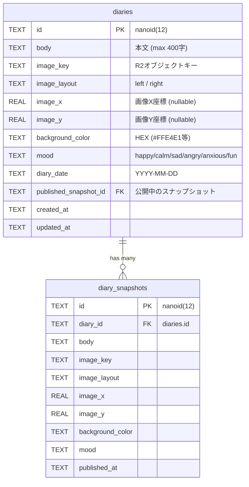
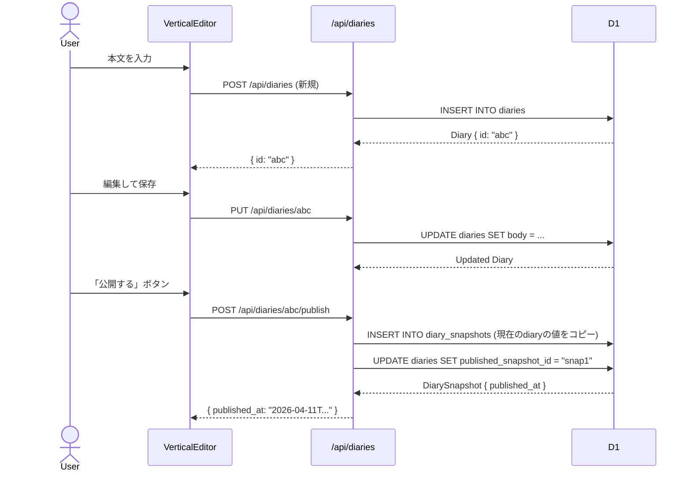
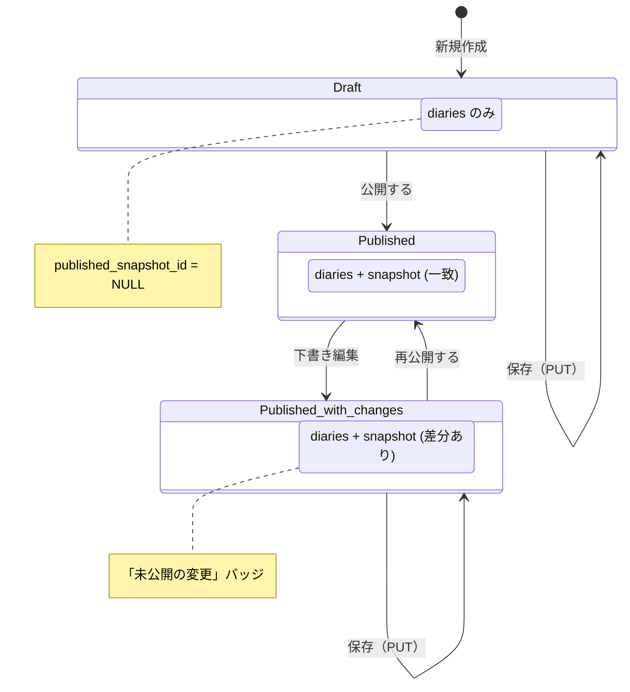

# Database & Publishing

## Overview

Cloudflare D1 (SQLite) を使用。下書きと公開スナップショットを分離した2テーブル構成。

## テーブル構成



## 公開フロー



## 下書きと公開の関係



## 一覧の表示ロジック

| 認証状態 | 表示対象 | カード本文 | バッジ |
|---------|---------|-----------|--------|
| 認証済み | 全日記 | 公開版 (snapshot_body) 優先 | 未公開: 「下書き」 / 差分あり: 「未公開の変更」 |
| 未認証 | 公開済みのみ | 公開版 (snapshot_body) | なし |

## 削除時のクリーンアップ

```
DELETE /api/diaries/:id
  1. diary の image_key を取得
  2. 全 snapshot の image_key を取得 (listSnapshotImageKeys)
  3. 重複除去して画像を R2 から best-effort で一括削除
  4. OGP キャッシュを R2 から best-effort で削除
  5. DELETE FROM diaries (CASCADE で snapshots も削除)
```

## 関連ファイル

| ファイル | 役割 |
|---------|------|
| `db/schema.sql` | テーブル定義 |
| `db/migrations/*.sql` | 既存DB向けの個別 migration |
| `app/lib/db.ts` | DB操作関数・型定義 |
| `app/routes/api/diaries.ts` | 新規作成 API |
| `app/routes/api/diaries/[id].ts` | 取得・更新・削除 API |
| `app/routes/api/diaries/[id]/publish.ts` | 公開 API |
