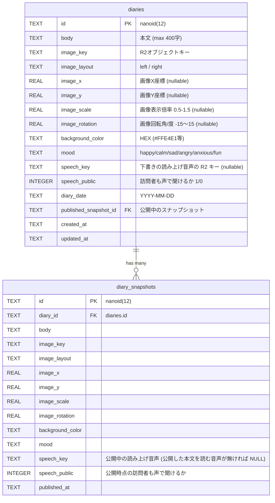
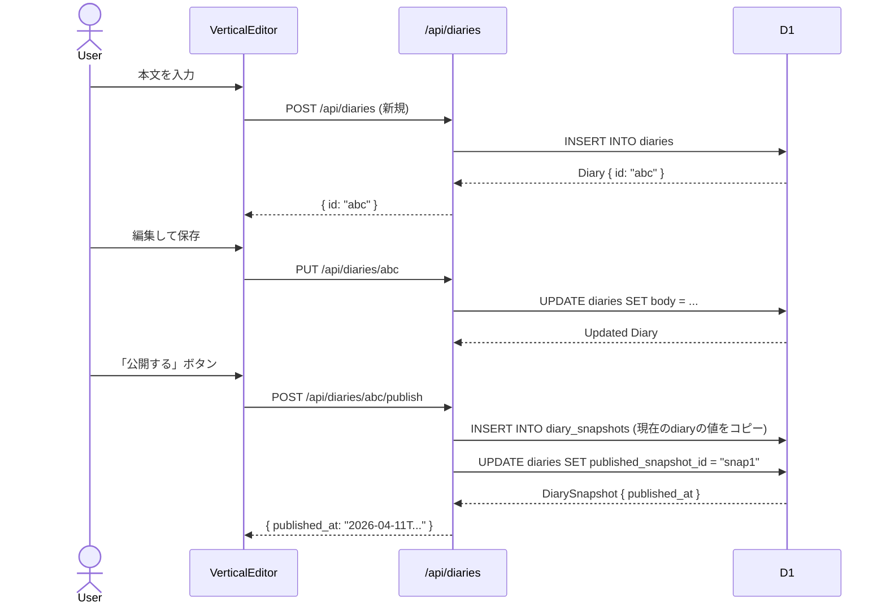
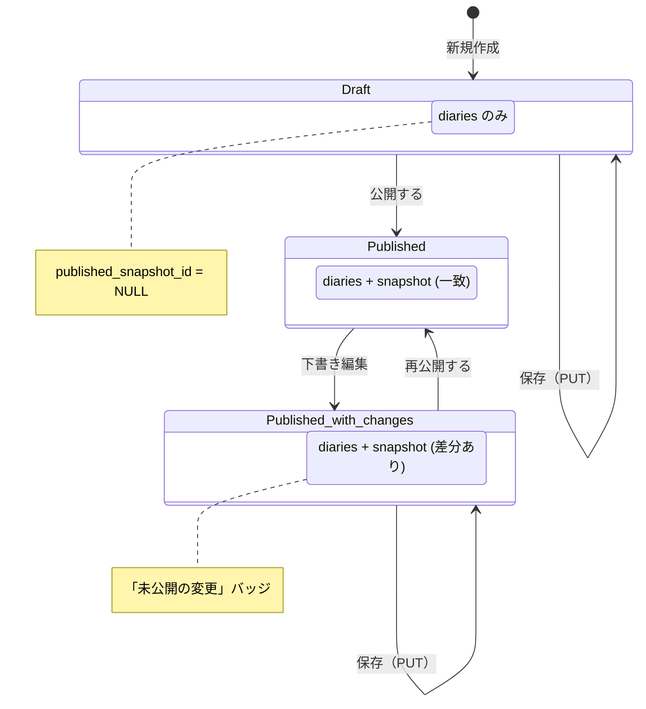

# Database & Publishing

## Overview

Cloudflare D1 (SQLite) を使用。下書きと公開スナップショットを分離した2テーブル構成。

## 日付ごとの制限

- `diaries.diary_date` のユニーク索引で、下書き・公開を問わず1日1件を保証する。基準は作成日時ではなく日記の対象日。
- `/new` は今日（JST）の日記があれば `/edit/{id}` にリダイレクトする。
- 新規作成や日付変更が既存の日記と重複すると、API は `409` と `existing_diary_id` を返す。同時リクエストの重複もDBの制約で拒否する。既存IDの取得に失敗した場合も `409` を維持し、`existing_diary_id` は `null` にする。
- 編集画面は重複時も入力内容を保持し、既存の日記を別タブで確認するリンクを表示する。既存の日記を自動で上書きしない。
- 同じ日記の保存・編集・再公開、日記のない過去日への作成は制限しない。削除した日付には再作成できる。

### 既存DBへの適用

`20260908_0001_unique_diary_date.sql` は重複があると索引の作成時に失敗し、既存の日記を削除・統合しない。適用前に次のSQLで確認する。

```sql
SELECT diary_date, COUNT(*) AS count
FROM diaries
GROUP BY diary_date
HAVING COUNT(*) > 1;
```

本番DBへの適用前には、remote を明示して同じ重複チェックを実行する。

```bash
pnpm wrangler d1 execute 400-diary-db --remote --command 'SELECT diary_date, COUNT(*) AS count FROM diaries GROUP BY diary_date HAVING COUNT(*) > 1;'
```

重複があればエクスポートで内容を保全し、残す日記や正しい日付を確認してから手動で解消する。重複の解消後にマイグレーションを再実行する。

## テーブル構成


```mermaid
erDiagram
    diaries ||--o{ diary_snapshots : "has many"
    diaries {
        TEXT id PK "nanoid(12)"
        TEXT body "本文 (max 400字)"
        TEXT image_key "R2オブジェクトキー"
        TEXT image_layout "left / right"
        REAL image_x "画像X座標 (nullable)"
        REAL image_y "画像Y座標 (nullable)"
        REAL image_scale "画像表示倍率 0.5-1.5 (nullable)"
        REAL image_rotation "画像回転角/度 -15〜15 (nullable)"
        TEXT background_color "HEX (#FFE4E1等)"
        TEXT mood "happy/calm/sad/angry/anxious/fun"
        TEXT speech_key "下書きの読み上げ音声の R2 キー (nullable)"
        INTEGER speech_public "訪問者も声で聞けるか 1/0"
        TEXT diary_date "YYYY-MM-DD"
        TEXT published_snapshot_id FK "公開中のスナップショット"
        TEXT created_at
        TEXT updated_at
    }
    diary_snapshots {
        TEXT id PK "nanoid(12)"
        TEXT diary_id FK "diaries.id"
        TEXT body
        TEXT image_key
        TEXT image_layout
        REAL image_x
        REAL image_y
        REAL image_scale
        REAL image_rotation
        TEXT background_color
        TEXT mood
        TEXT speech_key "公開中の読み上げ音声 (公開した本文を読む音声が無ければ NULL)"
        INTEGER speech_public "公開時点の訪問者も声で聞けるか"
        TEXT published_at
    }
```

## 公開フロー


```mermaid
sequenceDiagram
    actor User
    participant Editor as VerticalEditor
    participant API as /api/diaries
    participant DB as D1

    User->>Editor: 本文を入力
    Editor->>API: POST /api/diaries (新規)
    API->>DB: INSERT INTO diaries
    DB-->>API: Diary { id: "abc" }
    API-->>Editor: { id: "abc" }

    User->>Editor: 編集して保存
    Editor->>API: PUT /api/diaries/abc
    API->>DB: UPDATE diaries SET body = ...
    DB-->>API: Updated Diary

    User->>Editor: 「公開する」ボタン
    Editor->>API: POST /api/diaries/abc/publish
    API->>DB: INSERT INTO diary_snapshots (現在のdiaryの値をコピー)
    API->>DB: UPDATE diaries SET published_snapshot_id = "snap1"
    DB-->>API: DiarySnapshot { published_at }
    API-->>Editor: { published_at: "2026-04-11T..." }
```

### 読み上げ音声の引き継ぎ

公開時、`speech_public` はそのままスナップショットへ写す。`speech_key` は、保存済みの本文と気分から計算したキーと一致するときは下書きの音声を写す。一致しなければ、直前の公開版と本文が同じときだけその音声を引き継ぎ、それ以外は NULL にする（内容の違う古い音声を公開しない）。`speech_key` は保存 API からは書き換えられず、音声の生成・削除 API だけが書く。公開後は、下書きと公開中のどちらからも参照されていない音声を R2 から削除する。詳細は [Speech Output](./speech-output.md) を参照。

## 下書きと公開の関係


```mermaid
stateDiagram-v2
    [*] --> Draft: 新規作成
    Draft --> Draft: 保存（PUT）
    Draft --> Published: 公開する
    Published --> Published_with_changes: 下書き編集
    Published_with_changes --> Published: 再公開する
    Published_with_changes --> Published_with_changes: 保存（PUT）

    state Draft {
        direction LR
        diaries_only: diaries のみ
        note right of diaries_only: published_snapshot_id = NULL
    }
    state Published {
        direction LR
        synced: diaries + snapshot (一致)
    }
    state Published_with_changes {
        direction LR
        diverged: diaries + snapshot (差分あり)
        note right of diverged: 「未公開の変更」バッジ
    }
```

## 一覧の表示ロジック

一覧は日付の降順で取得し、次のページでは `diary_date < before_date` を検索条件にする。日付が一意なので、同日内のID比較やIDによる並べ替えは不要。日付のユニーク索引を使って範囲検索する。

API のカーソル形式は `before_date` と `before_id` の組を維持する。両方の指定と形式検証を引き続き行い、レスポンスの `next` にも両方を含めるが、DB検索では日付だけを境界として使う。

| 認証状態 | 表示対象 | カード本文 | バッジ |
|---------|---------|-----------|--------|
| 認証済み | 全日記 | 公開版 (snapshot_body) 優先 | 未公開: 「下書き」 / 差分あり: 「未公開の変更」 |
| 未認証 | 公開済みのみ | 公開版 (snapshot_body) | なし |

## 削除時のクリーンアップ

```
DELETE /api/diaries/:id
  1. diary の image_key を取得
  2. 全 snapshot の image_key を取得 (listSnapshotImageKeys)
  3. 重複除去して画像を R2 から best-effort で一括削除
  4. OGP キャッシュと読み上げ音声（speech/{id}/ 配下）を R2 から best-effort で削除
  5. DELETE FROM diaries (CASCADE で snapshots も削除)
```

## 関連ファイル

| ファイル | 役割 |
|---------|------|
| `db/schema.sql` | テーブル定義 |
| `db/migrations/*.sql` | 既存DB向けの個別 migration |
| `app/lib/db.ts` | DB操作関数・型定義 |
| `app/routes/api/diaries.ts` | 新規作成 API |
| `app/routes/api/diaries/[id].ts` | 取得・更新・削除 API |
| `app/routes/api/diaries/[id]/publish.ts` | 公開 API |
| `app/routes/api/diaries/[id]/speech.ts` | 読み上げ音声の生成・削除 API |
