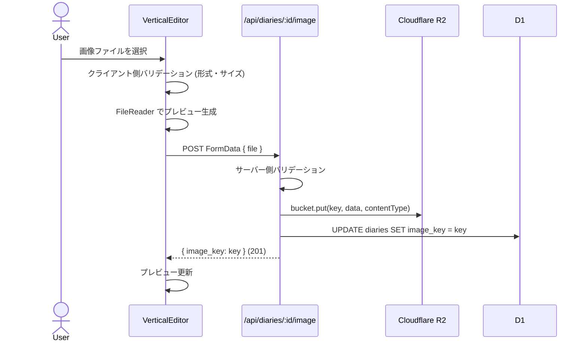
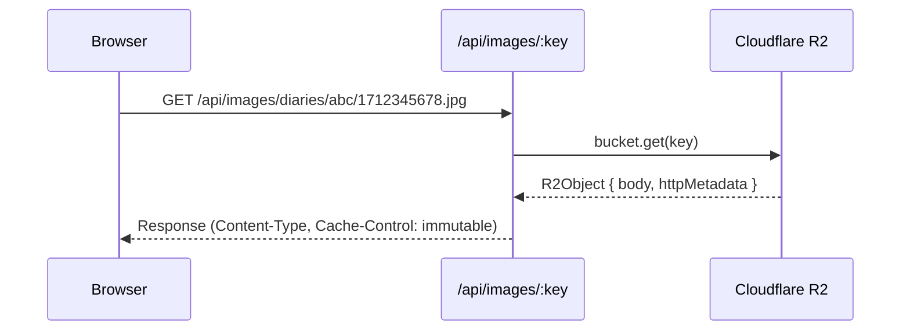
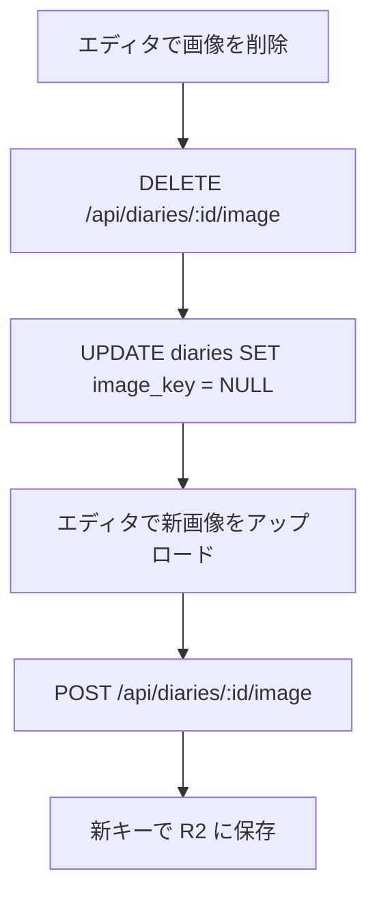
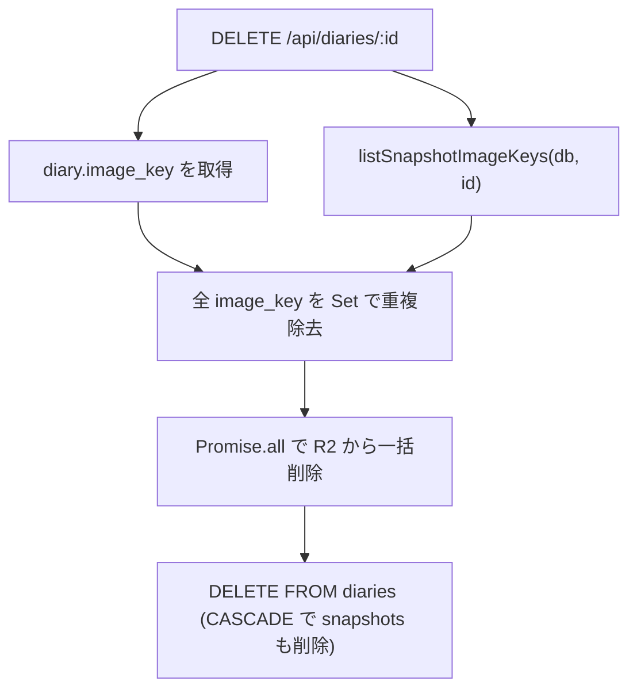

# Image Upload & Storage

## Overview

Cloudflare R2 を使った画像のアップロード・配信・削除。日記1件につき画像1枚。テキストの回り込みレイアウトと連携する。

## R2 ストレージ構成

```
R2 Bucket: 400-diary-images
└── diaries/
    └── {diaryId}/
        └── {timestamp}.{ext}    ← 例: diaries/abc123/1712345678.jpg
```

- キー生成: `diaries/${diaryId}/${Date.now()}.${ext}`
- タイムスタンプでユニーク性を保証（同じ日記への再アップロードで上書きしない）

## バリデーション

| チェック | 制限 | エラーメッセージ |
|---------|------|----------------|
| ファイル形式 | JPEG, PNG, WebP, GIF | 「JPEG, PNG, WebP, GIF のみアップロードできます」 |
| ファイルサイズ | 10MB以下 | 「画像は10MB以内にしてください」 |

クライアント側とサーバー側の両方でバリデーション（多層防御）。

## 前提条件

画像アップロードは `POST /api/diaries/:id/image` で日記IDを必要とするため、**日記を一度保存してからでないと画像を追加できない**。新規作成時はまず本文を保存し、その後に画像をアップロードする流れになる。

## アップロードフロー



## 画像配信フロー



### キャッシュ戦略

```
Cache-Control: public, max-age=31536000, immutable
```

- 1年間キャッシュ
- `immutable`: 画像は変更されない（タイムスタンプベースのキーのため安全）
- 画像の差し替え時は新しいキーが生成される

## 削除フロー

### 画像の差し替え



### 日記の削除時



- 下書きの画像キーとスナップショットの画像キーを両方収集
- R2 のオーファン画像を防ぐ

## 画像レイアウト

画像は `image_x` / `image_y`（REAL, nullable）で任意の座標に配置できる。プレビュー画面ではドラッグで自由に移動可能。

- `image_x` / `image_y` が設定されている場合: その座標に画像を配置
- `image_x` / `image_y` が null の場合: `image_layout`（`left` / `right`）からデフォルト位置を導出

```
自由配置（画像が中央付近）:
┌──────────────────────┐
│あいう   ┌──────┐     │
│えおか   │      │     │
│        │ 写真 │     │
│きくけ   │      │     │
│こさし   └──────┘     │
│すせそたちつてとな     │
└──────────────────────┘
  ↕ 画像と重なる列は上下に分割
```

FlowText コンポーネントが `computeSlots` で画像を障害物として扱い、重なる列を上下に分割してテキストの回り込みを実現する。

## storage.ts の関数

| 関数 | 用途 |
|------|------|
| `validateImage(size, type)` | 形式・サイズチェック |
| `generateImageKey(diaryId, mime)` | R2 キー生成 |
| `uploadImage(bucket, key, data, contentType)` | R2 へアップロード |
| `getImage(bucket, key)` | R2 から取得 (body + contentType) |
| `deleteImage(bucket, key)` | R2 から削除 |

## 関連ファイル

| ファイル | 役割 |
|---------|------|
| `app/lib/storage.ts` | R2 操作・バリデーション |
| `app/routes/api/diaries/[id]/image.ts` | アップロード・削除 API |
| `app/routes/api/images/[...key].ts` | 画像配信エンドポイント |
| `app/islands/vertical-editor.tsx` | アップロード UI・プレビュー |
| `app/islands/flow-text.tsx` | 画像回り込みレイアウト |
| `app/lib/db.ts` | `listSnapshotImageKeys` (削除時の R2 クリーンアップ) |
