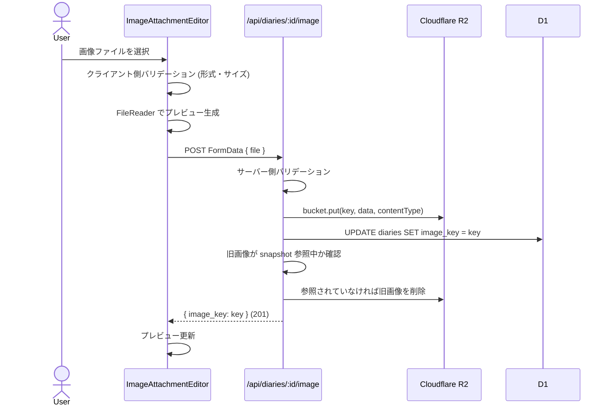
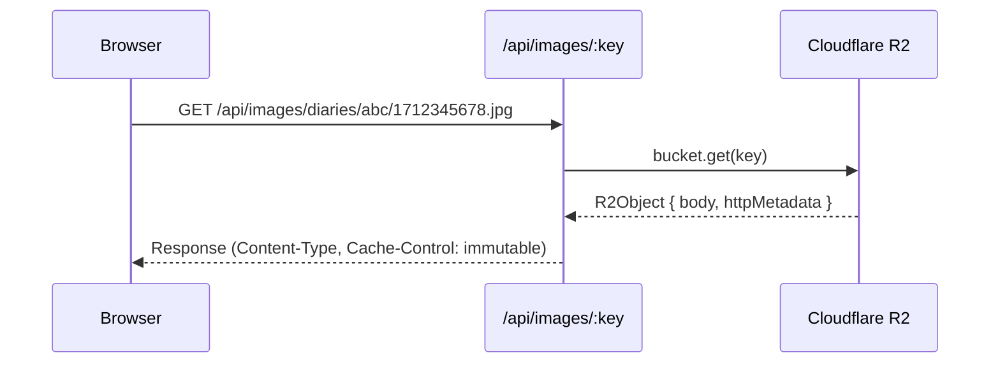
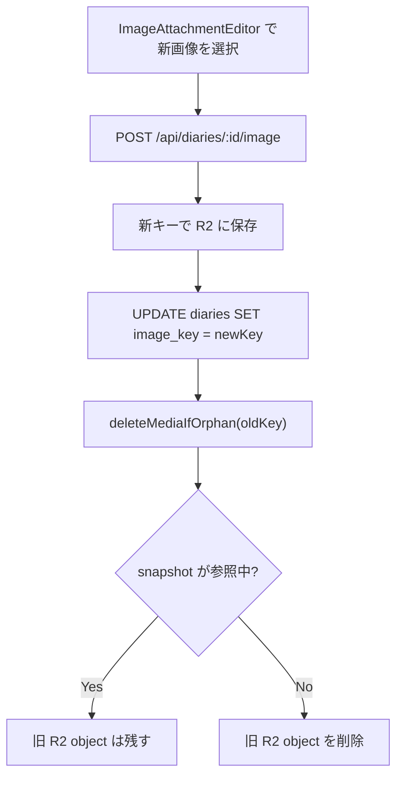
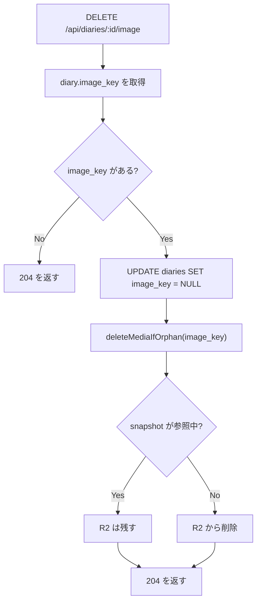
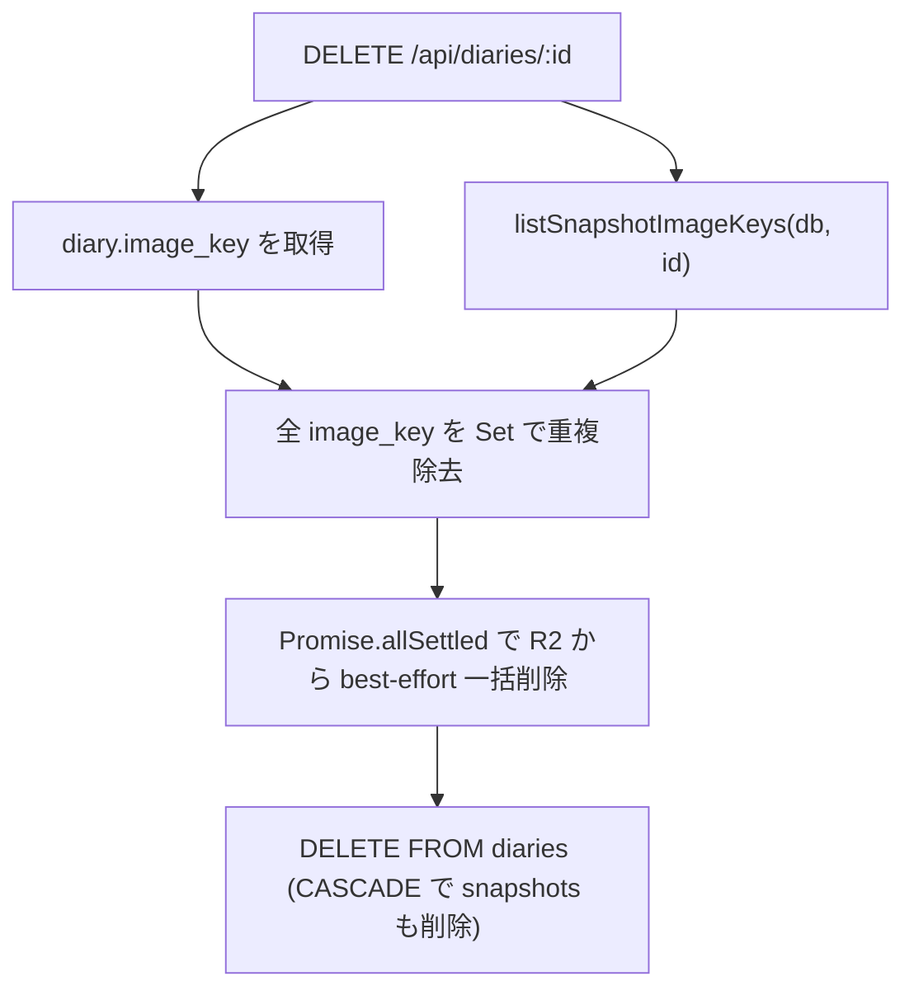

# Image Upload & Storage

## Overview

Cloudflare R2 を使った画像のアップロード・配信・削除。日記1件につき画像1枚。テキストの回り込みレイアウトと連携する。

## R2 ストレージ構成

```
R2 Bucket: 400-diary-images
└── diaries/
    └── {diaryId}/
        └── {timestamp}-{id}.{ext}    ← 例: diaries/abc123/1712345678-a1b2c3d4.jpg
```

- キー生成: `diaries/${diaryId}/${Date.now()}-${nanoid(8)}.${ext}`
- タイムスタンプと短いランダム ID でユニーク性を保証（同じ日記への再アップロードで上書きしない）

## バリデーション

| チェック | 制限 | エラーメッセージ |
|---------|------|----------------|
| ファイル形式 | JPEG, PNG, WebP, GIF | 「JPEG, PNG, WebP, GIF のみアップロードできます」 |
| ファイルサイズ | 10MB以下 | 「画像は10MB以内にしてください」 |

クライアント側とサーバー側の両方でバリデーション（多層防御）。

## 前提条件

画像アップロードは `POST /api/diaries/:id/image` で日記IDを必要とするため、**日記を一度保存してからでないと画像を追加できない**。新規作成時はまず本文を保存し、その後に画像をアップロードする流れになる。

## アップロードフロー



DB 更新は R2 アップロード後に行う。旧画像の R2 削除は `deleteMediaIfOrphan` 経由の best-effort で、削除に失敗してもレスポンスは成功のまま返す。

## 画像配信フロー



### キャッシュ戦略

```
Cache-Control: public, max-age=31536000, immutable
```

- 1年間キャッシュ
- `immutable`: 画像は変更されない（タイムスタンプベースのキーのため安全）
- 画像の差し替え時は新しいキーが生成される

## 削除フロー

### 画像の差し替え



### 画像の削除



DB 更新を先に行い、DB 更新に失敗した場合は R2 を削除しない。公開スナップショットが参照している画像も削除しない。

### 日記の削除時



- 下書きの画像キーとスナップショットの画像キーを両方収集
- R2 のオーファン画像を防ぐ

## 画像レイアウト

画像は `image_x` / `image_y`（REAL, nullable）で任意の座標に配置できる。プレビュー画面ではドラッグで自由に移動可能。

- `image_x` / `image_y` が設定されている場合: その座標に画像を配置
- `image_x` / `image_y` が null の場合: `image_layout`（`left` / `right`）からデフォルト位置を導出

表示サイズは `image_scale`（REAL, nullable）で調整できる。エディタのスライダー、またはプレビュー上のピンチ操作（指2本）で 0.5〜1.5 倍（null は 1.0 扱い）を指定する。自然サイズ（画像ファイル固有のピクセル寸法。`naturalWidth`/`naturalHeight`）を基準枠（コンテナ幅 30% / 高さ 256px）に収めたサイズが倍率 1.0 の基準で、そこに倍率を乗算した幅・高さを img に明示指定するため、基準枠より小さい画像でも倍率どおりに拡縮される。下限はタップ・視認性、上限はテキストの回り込み先の確保が理由。

```
自由配置（画像が中央付近）:
┌──────────────────────┐
│あいう   ┌──────┐     │
│えおか   │      │     │
│        │ 写真 │     │
│きくけ   │      │     │
│こさし   └──────┘     │
│すせそたちつてとな     │
└──────────────────────┘
  ↕ 画像と重なる列は上下に分割
```

FlowText コンポーネントが `computeSlots` で画像を障害物として扱い、重なる列を上下に分割してテキストの回り込みを実現する。

## storage.ts の関数

| 関数 | 用途 |
|------|------|
| `validateImage(size, type)` | 形式・サイズチェック |
| `generateImageKey(diaryId, mime)` | R2 キー生成 |
| `uploadImage(bucket, key, data, contentType)` | R2 へアップロード |
| `getImage(bucket, key)` | R2 から取得 (body + contentType) |
| `deleteImage(bucket, key)` | R2 から削除 |

## セキュリティ上の考慮

### 未公開日記の画像アクセス

`GET /api/images/diaries/...` エンドポイントは**認可チェックを行いません**。そのため、URL を知っていれば誰でも画像を取得できます。未公開日記の画像でも同様です。

このポリシーが受容可能なリスクと判断している理由：

1. **キーの推測困難性**: 画像キーは `diaries/{diaryId}/{timestamp}-{nanoid(8)}.{ext}` 形式で生成されます。`nanoid(8)` は約 281兆通りの組み合わせを持ち、タイムスタンプとの組み合わせで実質的に推測が不可能です
2. **単一ユーザー前提**: 本アプリケーションは単一ユーザーの個人日記を想定した設計です。アップロードできるのはオーナーのみであり、URL を知られる機会は限定的です
3. **露出するのは画像のみ**: 仮に URL が漏れても露出するのは画像単体で、日記本文は露出しません。本文の公開制御は snapshot の仕組み（未認証時は公開 snapshot のみ返す）で担保されています

### 将来の運用における認可チェック追加の検討

以下のシナリオでは、認可チェック機構の追加が**必要になります**：

- マルチユーザー化: 複数ユーザーが同じシステムを使用する場合
- 機密性の高い画像: 非公開日記に企業資料・個人情報など高機密の画像が含まれる可能性がある場合

### エンドポイント露出制御

`diaries/` プレフィックス以外の R2 オブジェクト（`fonts/` や `og/` など内部用途）は、このエンドポイント経由では配信されません（`app/routes/api/images/[...key].ts` で prefix チェック）。これにより、意図しない内部オブジェクトの外部露出を防いでいます。

## 関連ファイル

| ファイル | 役割 |
|---------|------|
| `app/lib/storage.ts` | R2 操作・バリデーション |
| `app/lib/media-cleanup.ts` | snapshot 参照を考慮した R2 孤児削除 |
| `app/routes/api/diaries/[id]/image.ts` | アップロード・削除 API |
| `app/routes/api/images/[...key].ts` | 画像配信エンドポイント |
| `app/routes/api/diaries/[id].ts` | 日記削除時の画像 R2 クリーンアップ |
| `app/islands/image-attachment-editor.tsx` | アップロード・削除 UI、ローカル preview 生成 |
| `app/islands/vertical-editor.tsx` | 編集画面での画像 state / 座標 state の保持と子コンポーネントへの受け渡し |
| `app/islands/flow-text.tsx` | 画像回り込みレイアウト |
| `app/lib/db.ts` | `listSnapshotImageKeys` (削除時の R2 クリーンアップ) |
