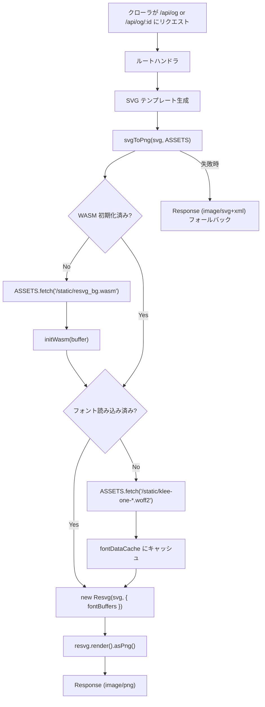

# OGP Image Generation

## Overview

SNS でシェアされた際に表示される OGP (Open Graph Protocol) 画像を、サーバーサイドで PNG として動的生成する。SVG テンプレートを `@resvg/resvg-wasm` で PNG にレンダリングし、X (Twitter) を含む全プラットフォームでの表示を保証する。

## なぜ PNG か

X (Twitter) は `image/svg+xml` 形式の OGP 画像をサポートしていない。PNG はすべての SNS プラットフォームで確実に表示される。

## アーキテクチャ



## エンドポイント

| エンドポイント | 用途 | SVG の内容 |
|--------------|------|-----------|
| `GET /api/og` | トップページ用 OGP | アプリ名 + サブタイトル |
| `GET /api/og/:id` | 日記個別 OGP | 日付ラベル + アプリ名 + 背景色 |

### レスポンスヘッダ

```
Content-Type: image/png
Cache-Control: public, max-age=86400
```

24 時間キャッシュ。Cloudflare CDN でエッジキャッシュされる。

## OGP メタタグ

`_renderer.tsx` で OGP メタタグを出力する。

```html
<meta property="og:image" content="{origin}/api/og" />
<meta name="twitter:card" content="summary_large_image" />
```

| ルート | `ogImage` の値 |
|-------|---------------|
| `/` (トップ) | `/api/og` |
| `/d/:id` (公開ページ) | `/api/og/{diary.id}` |

## SVG テンプレート

画像サイズは 1200×630px（OGP 推奨サイズ）。

### トップページ用

```svg
<svg width="1200" height="630">
  <rect fill="#faf9f6" />          <!-- 背景 -->
  <text font-size="64" font-weight="600">{appName}</text>
  <text font-size="28">{サブタイトル}</text>
</svg>
```

### 日記個別用

```svg
<svg width="1200" height="630">
  <rect fill="{snapshot.background_color}" />   <!-- 日記の背景色 -->
  <text font-size="52" font-weight="600">{dateLabel}の日記</text>
  <text font-size="32">{appName}</text>
</svg>
```

## SVG → PNG 変換

### resvg-wasm

WebAssembly 版の SVG レンダラ。Cloudflare Workers 上で動作する。

```
@resvg/resvg-wasm (2.4MB WASM バイナリ)
  ├── initWasm()     … WASM 初期化 (1回のみ)
  ├── new Resvg()    … SVG パース + フォント設定
  └── render()       … ラスタライズ → PNG
```

### フォント

OGP で使用する文字のみのサブセットフォントをバンドルしている。

| ファイル | サイズ | 内容 |
|---------|-------|------|
| `klee-one-400-ogp-subset.ttf` | 332KB | Regular (サブタイトル・アプリ名) |
| `klee-one-600-ogp-subset.ttf` | 337KB | SemiBold (タイトル・日付) |

TTF 形式を使用している。resvg-wasm の `fontBuffers` で確実に読み込める（woff2 は resvg のビルド構成によっては非対応の場合がある）。

サブセットに含まれる文字:

```
しまぶが字文で綴る日記の月火水木金土0123456789/() （スペース）
```

`@fontsource/klee-one` からサブセットを抽出し、`fonttools` (Python) でマージして生成した。

### キャッシュ戦略

Worker インスタンス内でモジュールレベルの変数にキャッシュする。

| 対象 | キャッシュ変数 | ライフサイクル |
|-----|-------------|-------------|
| WASM 初期化状態 | `wasmInitialized` | Worker インスタンスの生存期間 |
| フォントデータ | `fontDataCache` | Worker インスタンスの生存期間 |

コールドスタート時のみ ASSETS から読み込み、以降はメモリキャッシュを使用する。

## エラーハンドリング

PNG 変換に失敗した場合、元の SVG を `image/svg+xml` でフォールバック返却する。

```typescript
try {
  const png = await svgToPng(svg, c.env.ASSETS)
  return new Response(png.buffer, { headers: { 'Content-Type': 'image/png' } })
} catch {
  return new Response(svg, { headers: { 'Content-Type': 'image/svg+xml' } })
}
```

X では SVG は表示されないが、他のプラットフォームでは表示可能なものもあるため、完全にエラーを返すより良い。

## 静的アセット管理

| ファイル | git 管理 | 生成方法 |
|---------|---------|---------|
| `public/static/resvg_bg.wasm` | `.gitignore` で除外 | `prebuild` スクリプトで `node_modules` から自動コピー |
| `public/static/klee-one-*-ogp-subset.ttf` | git 管理 | `@fontsource/klee-one` + `fonttools` で生成 |

`prebuild` スクリプト (`package.json`):

```json
"prebuild": "cp node_modules/@resvg/resvg-wasm/index_bg.wasm public/static/resvg_bg.wasm"
```

## フォントサブセットの再生成

OGP に表示する文字が変わった場合、サブセットフォントの再生成が必要。

```bash
pip install fonttools brotli
```

```python
from fontTools.merge import Merger

subsets = [79, 109, 112, 114, 115, 116, 117, 118, 119]  # unicode.json で特定
base = 'node_modules/@fontsource/klee-one/files'

for weight in [400, 600]:
    files = [f'{base}/klee-one-{s}-{weight}-normal.woff2' for s in subsets]
    merger = Merger()
    font = merger.merge(files)
    font.flavor = None  # TTF として保存（resvg-wasm との互換性を保証）
    font.save(f'public/static/klee-one-{weight}-ogp-subset.ttf')
```

必要なサブセット番号は `node_modules/@fontsource/klee-one/unicode.json` から、対象文字の Unicode コードポイントを照合して特定する。

## 関連ファイル

| ファイル | 役割 |
|---------|------|
| `app/lib/og-image.ts` | WASM 初期化・フォント読み込み・SVG→PNG 変換 |
| `app/routes/api/og/index.ts` | トップページ OGP エンドポイント |
| `app/routes/api/og/[id].ts` | 日記個別 OGP エンドポイント |
| `app/routes/_renderer.tsx` | OGP メタタグ出力 |
| `app/factory.ts` | `ASSETS: Fetcher` バインディング型定義 |
| `public/static/resvg_bg.wasm` | resvg WASM バイナリ (prebuild で生成) |
| `public/static/klee-one-*-ogp-subset.ttf` | Klee One サブセットフォント (TTF) |
