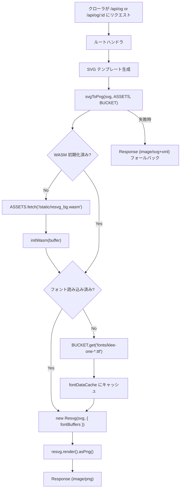

# OGP Image Generation

## Overview

SNS でシェアされた際に表示される OGP (Open Graph Protocol) 画像を、サーバーサイドで PNG として動的生成する。SVG テンプレートを `@resvg/resvg-wasm` で PNG にレンダリングし、X (Twitter) を含む全プラットフォームでの表示を保証する。

## なぜ PNG か

X (Twitter) は `image/svg+xml` 形式の OGP 画像をサポートしていない。PNG はすべての SNS プラットフォームで確実に表示される。

## アーキテクチャ



## エンドポイント

| エンドポイント | 用途 | SVG の内容 |
|--------------|------|-----------|
| `GET /api/og` | トップページ用 OGP | アプリ名 + サブタイトル |
| `GET /api/og/:id` | 日記個別 OGP | 日付ラベル + アプリ名 + 背景色 |

### レスポンスヘッダ

```
Content-Type: image/png
Cache-Control: public, max-age=86400
```

24 時間キャッシュ。Cloudflare CDN でエッジキャッシュされる。

## OGP メタタグ

`_renderer.tsx` で OGP メタタグを出力する。

```html
<meta property="og:image" content="{origin}/api/og" />
<meta name="twitter:card" content="summary_large_image" />
```

| ルート | `ogImage` の値 |
|-------|---------------|
| `/` (トップ) | `/api/og` |
| `/d/:id` (公開ページ) | `/api/og/{diary.id}` |

## SVG テンプレート

画像サイズは 1200×630px（OGP 推奨サイズ）。

### トップページ用

```svg
<svg width="1200" height="630">
  <rect fill="#faf9f6" />          <!-- 背景 -->
  <text font-size="64" font-weight="600">{appName}</text>
  <text font-size="28">{サブタイトル}</text>
</svg>
```

### 日記個別用

```svg
<svg width="1200" height="630">
  <rect fill="{snapshot.background_color}" />   <!-- 日記の背景色 -->
  <text font-size="52" font-weight="600">{dateLabel}の日記</text>
  <text font-size="32">{appName}</text>
</svg>
```

## SVG → PNG 変換

### resvg-wasm

WebAssembly 版の SVG レンダラ。Cloudflare Workers 上で動作する。

```
@resvg/resvg-wasm (2.4MB WASM バイナリ)
  ├── initWasm()     … WASM 初期化 (1回のみ)
  ├── new Resvg()    … SVG パース + フォント設定
  └── render()       … ラスタライズ → PNG
```

WASM バイナリは `public/static/resvg_bg.wasm` に配置し、ASSETS バインディングから読み込む。`prebuild` スクリプトで `node_modules` から自動コピーされる。

### フォント

Klee One フルフォント (TTF) を R2 に配置している。

| R2 キー | サイズ | 内容 |
|---------|-------|------|
| `fonts/klee-one-400.ttf` | ~11MB | Regular (サブタイトル・アプリ名) |
| `fonts/klee-one-600.ttf` | ~12MB | SemiBold (タイトル・日付) |

- **R2 に配置する理由**: フルフォント（全日本語文字対応）のため git リポジトリには含めず、R2 (BUCKET) から読み込む
- **TTF 形式**: resvg-wasm の `fontBuffers` で確実に読み込める
- **フル文字セット**: APP_NAME やテキスト変更時にフォント再生成が不要
- **ライセンス**: SIL Open Font License (OFL) — バンドル・配信 OK

### キャッシュ戦略

Worker インスタンス内でモジュールレベルの変数にキャッシュする。

| 対象 | 読み込み元 | キャッシュ変数 | ライフサイクル |
|-----|----------|-------------|-------------|
| WASM バイナリ | ASSETS (静的アセット) | `wasmInitialized` | Worker インスタンスの生存期間 |
| フォントデータ | BUCKET (R2) | `fontDataCache` | Worker インスタンスの生存期間 |

コールドスタート時のみ読み込み、以降はメモリキャッシュを使用する。

## エラーハンドリング

PNG 変換に失敗した場合、元の SVG を `image/svg+xml` でフォールバック返却する。

```typescript
try {
  const png = await svgToPng(svg, c.env.ASSETS, c.env.BUCKET)
  return new Response(png.buffer, { headers: { 'Content-Type': 'image/png' } })
} catch {
  return new Response(svg, { headers: { 'Content-Type': 'image/svg+xml' } })
}
```

X では SVG は表示されないが、他のプラットフォームでは表示可能なものもあるため、完全にエラーを返すより良い。

## ローカル R2 の OGP キャッシュ削除

OGP 画像の文言やレイアウトを変更したあと、ローカル開発環境で古い画像が表示され続ける場合は、ローカル R2 に保存された PNG キャッシュを削除する。

トップページ用 OGP は固定キー `og/top.png` に保存される。

```bash
pnpm wrangler r2 object delete 400-diary-images/og/top.png --local
```

日記個別 OGP はスナップショット単位で `og/{diaryId}/{snapshotId}.png` に保存される。`snapshotId` が不明な場合は、ローカル D1 から公開中スナップショット ID を確認する。

```bash
pnpm wrangler d1 execute 400-diary-db --local --command "SELECT id, diary_date, published_snapshot_id FROM diaries WHERE published_snapshot_id IS NOT NULL ORDER BY diary_date DESC;"
```

対象の日記 ID と `published_snapshot_id` を使って削除する。

```bash
pnpm wrangler r2 object delete 400-diary-images/og/<diaryId>/<snapshotId>.png --local
```

削除後に `/api/og` または `/api/og/<diaryId>` へアクセスすると、現在のコードで PNG が再生成される。ブラウザ側のキャッシュが残っている場合はハードリロードする。

## 本番 R2 の OGP キャッシュ削除

本番環境で同じ確認をする場合は `--remote` を明示する。`--local` を外すだけでも remote 扱いになることがあるが、誤操作を避けるため本番操作では `--remote` を付ける。

トップページ用 OGP:

```bash
pnpm wrangler r2 object delete 400-diary-images/og/top.png --remote
```

日記個別 OGP の `snapshotId` を本番 D1 から確認する。

```bash
pnpm wrangler d1 execute 400-diary-db --remote --command "SELECT id, diary_date, published_snapshot_id FROM diaries WHERE published_snapshot_id IS NOT NULL ORDER BY diary_date DESC;"
```

対象の日記 ID と `published_snapshot_id` を使って削除する。

```bash
pnpm wrangler r2 object delete 400-diary-images/og/<diaryId>/<snapshotId>.png --remote
```

削除後に本番 URL の `/api/og` または `/api/og/<diaryId>` へアクセスすると、現在デプロイされているコードで PNG が再生成される。SNS 側のカードキャッシュは別途残る場合がある。

## デプロイ手順

### 初回セットアップ（フォントを R2 にアップロード）

OGP 画像で使用する Klee One フォントを R2 にアップロードする。**初回のみ必要**。

```bash
# ローカル開発用
bash scripts/upload-fonts.sh --local

# リモート (本番) 用
bash scripts/upload-fonts.sh
```

スクリプトの処理内容:

1. GitHub ([fontworks-fonts/Klee](https://github.com/fontworks-fonts/Klee)) から TTF をダウンロード
2. `wrangler r2 object put` で R2 バケットにアップロード

アップロード後の R2 キー:

```
fonts/klee-one-400.ttf
fonts/klee-one-600.ttf
```

### 通常のデプロイ

フォントは R2 に永続化されているため、通常のデプロイでは特別な手順は不要。

```bash
pnpm run deploy
```

`prebuild` スクリプトが WASM バイナリを `public/static/` に自動コピーする。

## 静的アセット管理

| ファイル | 管理場所 | 生成方法 |
|---------|---------|---------|
| `resvg_bg.wasm` | `public/static/` (.gitignore) | `prebuild` で `node_modules` から自動コピー |
| `klee-one-400.ttf` | R2 (`fonts/`) | `scripts/upload-fonts.sh` で初回アップロード |
| `klee-one-600.ttf` | R2 (`fonts/`) | `scripts/upload-fonts.sh` で初回アップロード |

## 関連ファイル

| ファイル | 役割 |
|---------|------|
| `app/lib/og-image.ts` | WASM 初期化・R2 フォント読み込み・SVG→PNG 変換 |
| `app/routes/api/og/index.ts` | トップページ OGP エンドポイント |
| `app/routes/api/og/[id].ts` | 日記個別 OGP エンドポイント |
| `app/routes/_renderer.tsx` | OGP メタタグ出力 |
| `app/factory.ts` | `ASSETS: Fetcher`, `BUCKET: R2Bucket` バインディング型定義 |
| `public/static/resvg_bg.wasm` | resvg WASM バイナリ (prebuild で生成) |
| `scripts/upload-fonts.sh` | フォント生成・R2 アップロードスクリプト |
