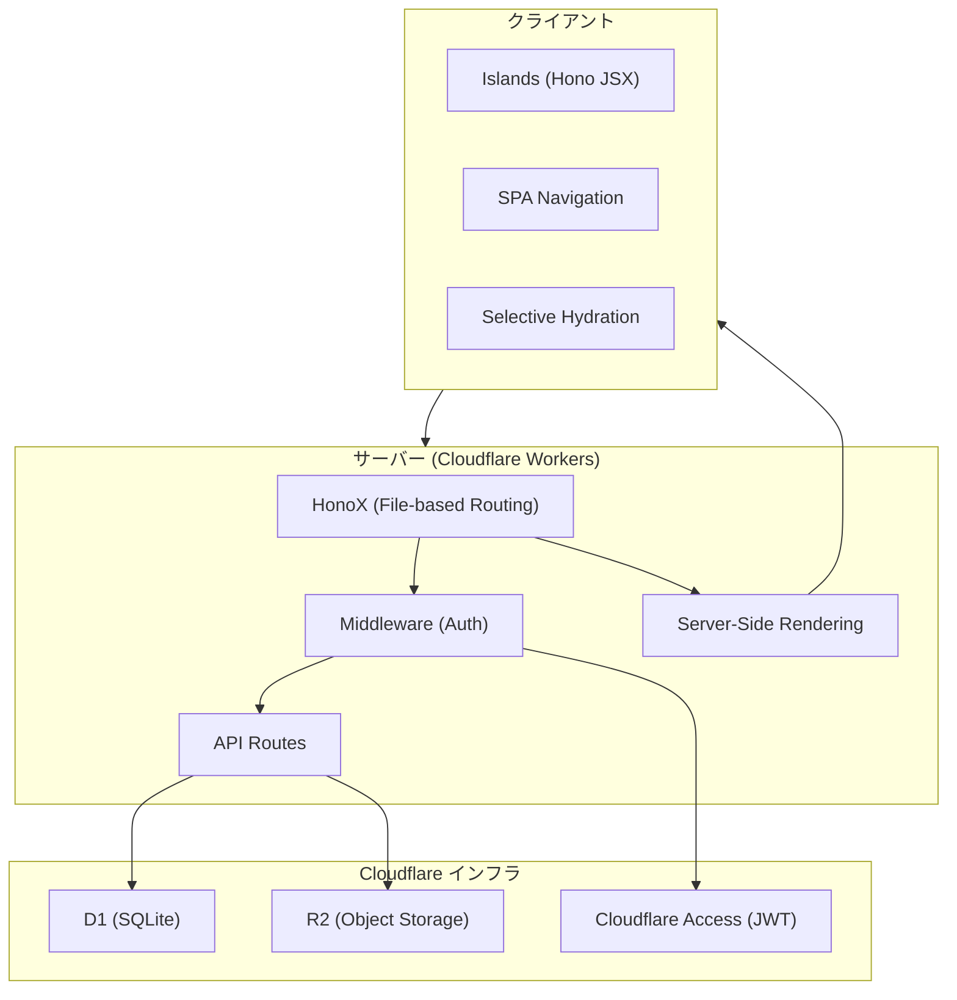
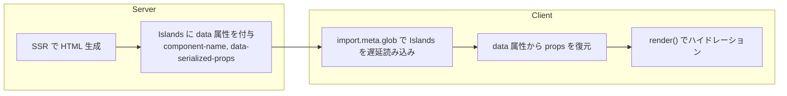
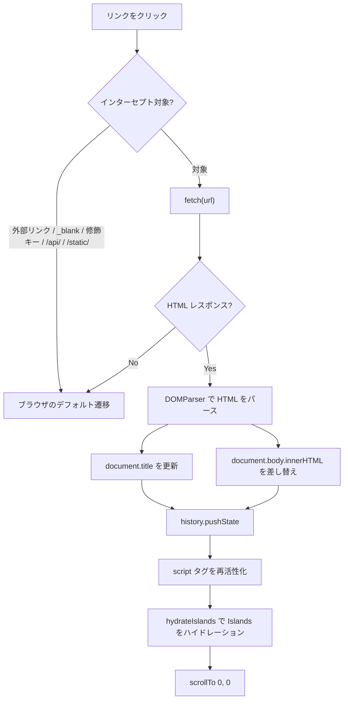
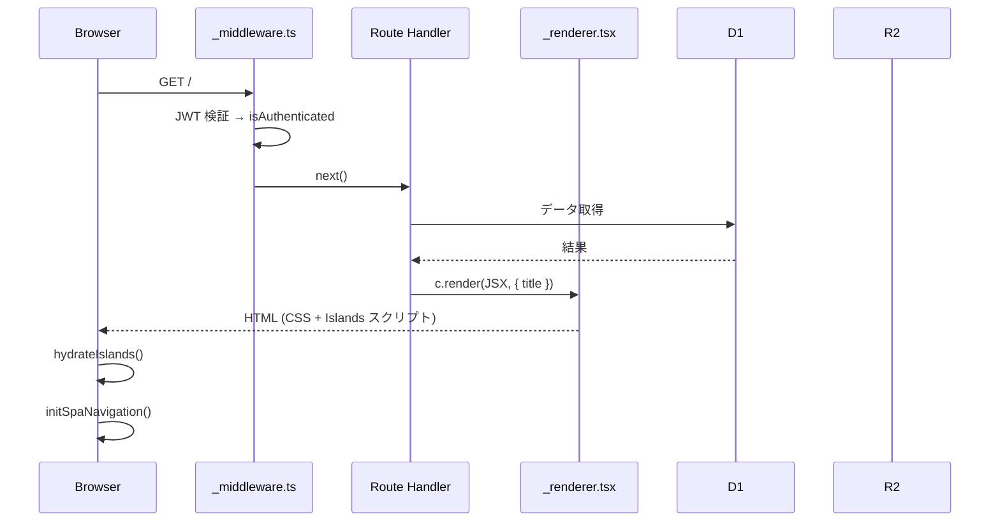
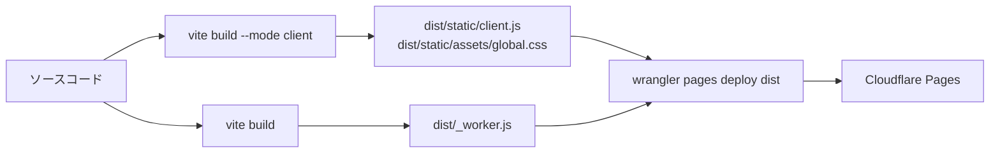

# Architecture Overview

## 技術スタック



## フレームワーク構成

| レイヤー | 技術 | 役割 |
|---------|------|------|
| フレームワーク | HonoX | ファイルベースルーティング + SSR |
| Web フレームワーク | Hono | リクエスト処理・ミドルウェア |
| JSX | Hono JSX | サーバー/クライアント共通の JSX |
| ビルド | Vite | クライアント/サーバーの2段階ビルド |
| ランタイム | Cloudflare Workers | エッジコンピューティング |
| DB | Cloudflare D1 | SQLite ベースの DB |
| ストレージ | Cloudflare R2 | S3 互換オブジェクトストレージ |
| 認証 | Cloudflare Access | SSO (JWT ベース) |

## ディレクトリ構造

```
app/
├── client.ts              # クライアントエントリポイント
├── server.ts              # サーバーエントリポイント
├── factory.ts             # Hono Factory (型定義)
├── spa-navigation.ts      # クライアントサイドナビゲーション
├── global.d.ts            # Web Speech API 型定義
├── routes/                # ファイルベースルーティング
│   ├── _middleware.ts     # 認証ミドルウェア
│   ├── _renderer.tsx      # HTML テンプレート
│   ├── index.tsx          # トップページ (カレンダー + 一覧)
│   ├── new.tsx            # 新規作成
│   ├── edit/[id].tsx      # 編集
│   ├── d/[id].tsx         # 公開ページ
│   ├── auth/400_diary.tsx # 認証コールバック
│   └── api/               # API エンドポイント
│       ├── diaries.ts
│       ├── diaries/[id].ts
│       ├── diaries/[id]/publish.ts
│       ├── diaries/[id]/image.ts
│       ├── images/[...key].ts
│       ├── og/index.ts
│       └── og/[id].ts
├── islands/               # インタラクティブコンポーネント
│   ├── vertical-editor.tsx
│   ├── flow-text.tsx
│   ├── calendar-view.tsx
│   └── image-uploader.tsx
├── lib/                   # 共有ロジック
│   ├── db.ts              # D1 操作
│   ├── auth.ts            # JWT 検証
│   ├── storage.ts         # R2 操作
│   ├── hydrate.ts         # Islands ハイドレーション
│   ├── mood.ts            # 気分データ
│   ├── colors.ts          # パステルカラー生成
│   ├── constants.ts       # MAX_BODY_LENGTH = 400
│   ├── format.ts          # 日付フォーマット
│   └── use-speech.ts      # 音声認識 Hook
└── styles/
    └── global.css         # グローバルスタイル
```

## Islands Architecture

ページ全体を JavaScript でハイドレーションするのではなく、インタラクティブな操作が必要なコンポーネント（`app/islands/` 配下）だけに JavaScript を読み込む方式。それ以外の部分はサーバーで生成した静的 HTML のまま配信される。



### ハイドレーション手順

1. サーバーが islands コンポーネントの HTML に `component-name`, `data-serialized-props` 属性を付与
2. `client.ts` が `hydrateIslands(document)` を呼ぶ
3. `import.meta.glob('/app/islands/**/*.tsx')` で islands を遅延読み込み対象に
4. DOM から未ハイドレーションの要素を検索（`[component-name]:not([data-hono-hydrated])`）
5. props を JSON パースし、`createElement` + `render` でマウント
6. `data-hono-hydrated` を設定して二重ハイドレーションを防止

### Islands コンポーネント一覧

| コンポーネント | 役割 | 状態 |
|--------------|------|------|
| `vertical-editor` | 縦書きエディタ（入力・保存・公開・画像・音声） | 最も複雑。多数の state |
| `flow-text` | テキスト流し込み表示（画像回り込み） | props からの派生（useMemo） |
| `calendar-view` | ヒートマップ + 月間カレンダー | selectedMonth のみ |
| `image-uploader` | 画像アップロード（単体版） | preview, uploading |

## SPA Navigation

フルページリロードなしで画面遷移を実現するクライアントサイドルーター。



### popstate 対応

ブラウザの戻る/進むボタンで `popstate` イベントを捕捉し、同じ `navigate` 関数で画面を更新（`pushState` は呼ばない）。

## リクエストライフサイクル



## ビルドパイプライン



## 環境設定

| 環境変数 | 必須 | 説明 |
|---------|------|------|
| `DB` | Yes | D1 データベースバインディング |
| `BUCKET` | Yes | R2 バケットバインディング |
| `CF_ACCESS_TEAM_DOMAIN` | Yes | Cloudflare Access のチームドメイン |
| `CF_ACCESS_AUD` | Yes | Cloudflare Access の AUD タグ |
| `APP_NAME` | No | アプリ名（デフォルト: `400字日記`） |
| `CF_WEB_ANALYTICS_TOKEN` | No | Cloudflare Web Analytics のトークン |
| `DEV_AUTH_BYPASS` | No | 開発時の認証バイパス |

## 設計文書一覧

| 文書 | 内容 |
|------|------|
| [Database & Publishing](./database.md) | テーブル構成・公開フロー・下書きと公開の関係 |
| [Vertical Text Layout](./vertical-text.md) | 縦書きエディタ・FlowText レイアウトエンジン |
| [Authentication](./authentication.md) | Cloudflare Access JWT 検証 |
| [Speech Input](./speech-input.md) | Web Speech API による音声入力 |
| [Image Upload & Storage](./image-upload.md) | R2 画像管理・配信・クリーンアップ |
| [Calendar & Heatmap](./calendar.md) | ヒートマップ・月間カレンダー・Mood システム |
| [OGP Image](./ogp-image.md) | OGP 画像の PNG 動的生成・フォント管理 |
