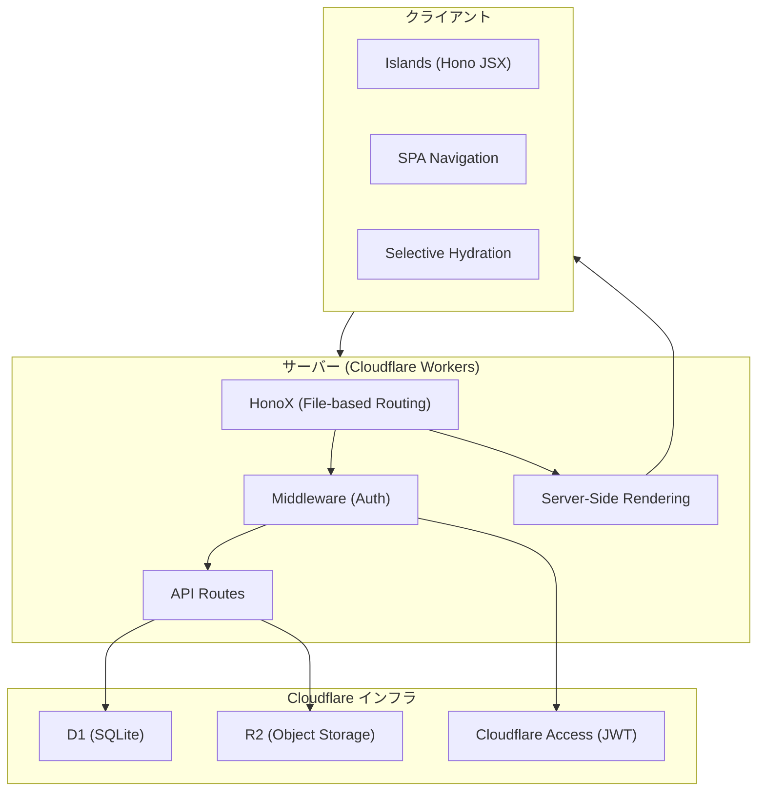
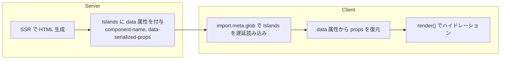
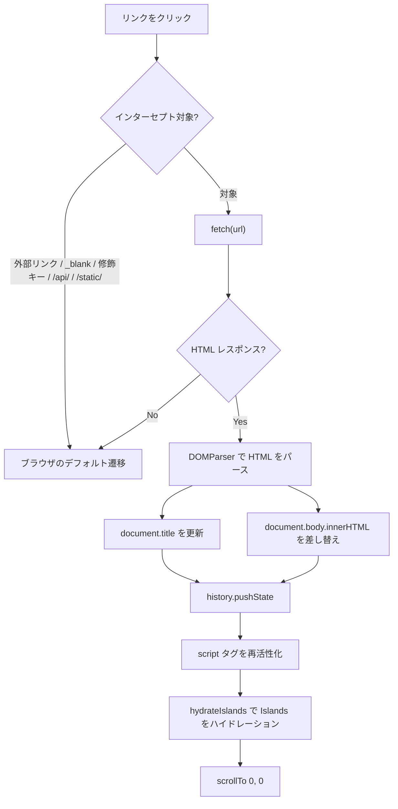
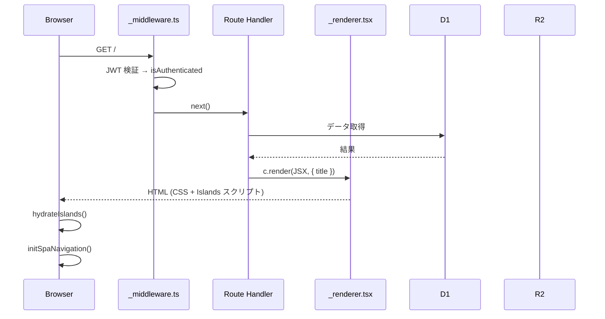
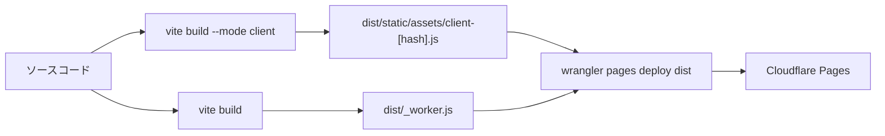

# Architecture Overview

## 技術スタック


```mermaid
graph TB
    subgraph Client["クライアント"]
        Islands["Islands (Hono JSX)"]
        SPA["SPA Navigation"]
        Hydrate["Selective Hydration"]
    end

    subgraph Server["サーバー (Cloudflare Workers)"]
        HonoX["HonoX (File-based Routing)"]
        MW["Middleware (Auth)"]
        API["API Routes"]
        SSR["Server-Side Rendering"]
    end

    subgraph Infra["Cloudflare インフラ"]
        D1["D1 (SQLite)"]
        R2["R2 (Object Storage)"]
        Access["Cloudflare Access (JWT)"]
    end

    Client --> Server
    HonoX --> MW --> API
    HonoX --> SSR
    API --> D1
    API --> R2
    MW --> Access
    SSR --> Client
```

## 日記の単位と画面遷移

日記は下書きを含めて対象日ごとに1件。1日に保存・編集・再公開できる回数に制限はない。日付の判定と重複時の処理は [Database & Publishing](./database.md#日付ごとの制限) を参照。

| 操作 | 振る舞い |
|------|----------|
| 「日記を書く」から `/new` を開く | 今日（JST）の日記があれば編集へ、なければ新規エディタへ |
| 日記のあるカレンダーの日付を押す | 本人は編集画面、訪問者は公開詳細へ |
| 既存の日記と同じ日付で新規保存・日付変更 | 保存を拒否し、入力内容を画面に残して既存の日記へのリンクを表示 |
| 公開詳細を開く・共有する | `/d/{id}` で個別の日記を表示。日付を表示し、日付内の連番は付けない |

## フレームワーク構成

| レイヤー | 技術 | 役割 |
|---------|------|------|
| フレームワーク | HonoX | ファイルベースルーティング + SSR |
| Web フレームワーク | Hono | リクエスト処理・ミドルウェア |
| JSX | Hono JSX | サーバー/クライアント共通の JSX |
| ビルド | Vite | クライアント/サーバーの2段階ビルド |
| ランタイム | Cloudflare Workers | エッジコンピューティング |
| DB | Cloudflare D1 | SQLite ベースの DB |
| ストレージ | Cloudflare R2 | S3 互換オブジェクトストレージ |
| 認証 | Cloudflare Access | SSO (JWT ベース) |

## ディレクトリ構造

```
app/
├── client.ts              # クライアントエントリポイント
├── server.ts              # サーバーエントリポイント
├── factory.ts             # Hono Factory (型定義)
├── spa-navigation.ts      # クライアントサイドナビゲーション
├── global.d.ts            # Web Speech API 型定義
├── routes/                # ファイルベースルーティング
│   ├── _middleware.ts     # 認証ミドルウェア
│   ├── _renderer.tsx      # HTML テンプレート
│   ├── index.tsx          # トップページ (カレンダー + 一覧)
│   ├── new.tsx            # 今日の日記を編集、未作成なら新規作成
│   ├── edit/[id].tsx      # 編集
│   ├── d/[id].tsx         # 公開ページ
│   ├── auth/400_diary.tsx # 認証コールバック
│   └── api/               # API エンドポイント
│       ├── diaries.ts
│       ├── diaries/[id].ts
│       ├── diaries/[id]/publish.ts
│       ├── diaries/[id]/image.ts
│       ├── diaries/[id]/speech.ts  # 読み上げ音声の生成・削除
│       ├── speech/[id].ts          # 読み上げ音声の配信（公開版）
│       ├── speech/[id]/draft.ts    # 読み上げ音声の配信（下書き）
│       ├── images/[...key].ts
│       ├── og/index.ts
│       └── og/[id].ts
├── islands/               # インタラクティブコンポーネント
│   ├── vertical-editor.tsx
│   ├── image-attachment-editor.tsx
│   ├── speech-editor.tsx
│   ├── speech-player.tsx
│   ├── flow-text.tsx
│   ├── calendar-view.tsx
│   ├── confirm-dialog.tsx
│   ├── delete-diary-button.tsx
│   └── mood-marker.tsx
├── lib/                   # 共有ロジック
│   ├── db.ts              # D1 操作
│   ├── auth.ts            # JWT 検証
│   ├── storage.ts         # R2 操作
│   ├── media-cleanup.ts   # snapshot 参照を考慮した R2 孤児削除
│   ├── og-cache.ts        # OGP 画像キャッシュ
│   ├── og-image.ts        # OGP 画像生成
│   ├── speech.ts          # 読み上げ音声（Gemini 呼び出し・R2 キー・削除）
│   ├── speech-style.ts    # 気分と話し方の対応表
│   ├── speech-cleanup.ts  # 使われなくなった読み上げ音声の削除
│   ├── speech-response.ts # 読み上げ音声の Range 対応配信
│   ├── speech-editor-state.ts # 編集画面の音声操作の表示の導出
│   ├── http-range.ts      # Range ヘッダの解釈
│   ├── hydrate.ts         # Islands ハイドレーション
│   ├── grid.ts            # 400字グリッド制御
│   ├── layout.ts          # 縦書き回り込み計算
│   ├── heatmap-scroll.ts  # ヒートマップ初期スクロール位置計算
│   ├── mood.ts            # 気分データ
│   ├── colors.ts          # パステルカラー生成
│   ├── constants.ts       # MAX_BODY_LENGTH = 400
│   ├── format.ts          # 日付フォーマット
│   ├── use-diary-draft.ts         # 下書き保存・公開 Hook
│   ├── use-vertical-text-input.ts # 縦書き入力 Hook
│   └── use-speech.ts              # 音声認識 Hook
└── styles/
    └── global.css         # グローバルスタイル
```

## Islands Architecture

ページ全体を JavaScript でハイドレーションするのではなく、インタラクティブな操作が必要なコンポーネント（`app/islands/` 配下）だけに JavaScript を読み込む方式。それ以外の部分はサーバーで生成した静的 HTML のまま配信される。


```mermaid
flowchart LR
    subgraph Server
        S1[SSR で HTML 生成]
        S2["Islands に data 属性を付与<br/>component-name, data-serialized-props"]
    end
    subgraph Client
        C1["import.meta.glob で Islands を遅延読み込み"]
        C2["data 属性から props を復元"]
        C3["render() でハイドレーション"]
    end
    S1 --> S2 --> C1 --> C2 --> C3
```

### ハイドレーション手順

1. サーバーが islands コンポーネントの HTML に `component-name`, `data-serialized-props` 属性を付与
2. `client.ts` が `hydrateIslands(document)` を呼ぶ
3. `import.meta.glob('/app/islands/**/*.tsx')` で islands を遅延読み込み対象に
4. DOM から未ハイドレーションの要素を検索（`[component-name]:not([data-hono-hydrated])`）
5. props を JSON パースし、`createElement` + `render` でマウント
6. `data-hono-hydrated` を設定して二重ハイドレーションを防止

### Islands コンポーネント一覧

| コンポーネント | 役割 | 状態 |
|--------------|------|------|
| `vertical-editor` | 縦書きエディタ全体の組み立て | 本文・画像添付・保存公開の状態を各 hook / 子コンポーネントへ委譲 |
| `image-attachment-editor` | 画像アップロード・削除 UI | エラー、削除確認 |
| `speech-editor` | 読み上げ音声の作成・試聴・削除、訪問者への公開の切り替え | 音声のキーと元の本文・気分、生成中、確認 |
| `speech-player` | 公開ページの「声で聞く」 | 再生中 |
| `flow-text` | テキスト流し込み表示（画像回り込み） | props からの派生（useMemo） |
| `calendar-view` | ヒートマップ + 月間カレンダー | selectedMonth のみ |
| `confirm-dialog` | 削除確認ダイアログ | 表示・非表示 |
| `delete-diary-button` | 日記削除ボタン | 削除中状態 |
| `mood-marker` | 公開ページの mood 表示 | props からの表示 |

## SPA Navigation

フルページリロードなしで画面遷移を実現するクライアントサイドルーター。


```mermaid
flowchart TD
    A[リンクをクリック] --> B{インターセプト対象?}
    B -->|"外部リンク / _blank / 修飾キー / /api/ / /static/"| C[ブラウザのデフォルト遷移]
    B -->|対象| D["fetch(url)"]
    D --> E{HTML レスポンス?}
    E -->|No| C
    E -->|Yes| F[DOMParser で HTML をパース]
    F --> G[document.title を更新]
    F --> H[document.body.innerHTML を差し替え]
    G & H --> I[history.pushState]
    I --> J[script タグを再活性化]
    J --> K[hydrateIslands で Islands をハイドレーション]
    K --> L[scrollTo 0, 0]
```

サーバーがリダイレクトした場合は、レスポンスの最終URLを履歴に記録する。`/new` から既存の日記へ進んだときも、アドレスバーは `/edit/{id}` になる。

### popstate 対応

ブラウザの戻る/進むボタンで `popstate` イベントを捕捉し、同じ `navigate` 関数で画面を更新（`pushState` は呼ばない）。リダイレクトがあれば `replaceState` で現在の履歴のURLを更新する。このときスクロール位置を含む `history.state` は保持して復元に使う。

## リクエストライフサイクル


```mermaid
sequenceDiagram
    participant Browser
    participant MW as _middleware.ts
    participant Route as Route Handler
    participant Renderer as _renderer.tsx
    participant DB as D1
    participant R2 as R2

    Browser->>MW: GET /
    MW->>MW: JWT 検証 → isAuthenticated
    MW->>Route: next()
    Route->>DB: データ取得
    DB-->>Route: 結果
    Route->>Renderer: c.render(JSX, { title })
    Renderer-->>Browser: HTML (CSS + Islands スクリプト)
    Browser->>Browser: hydrateIslands()
    Browser->>Browser: initSpaNavigation()
```

## ビルドパイプライン


```mermaid
flowchart LR
    A[ソースコード] --> B["vite build --mode client"]
    A --> C["vite build"]
    B --> D["dist/static/assets/client-[hash].js"]
    C --> E["dist/_worker.js"]
    D & E --> F["wrangler pages deploy dist"]
    F --> G[Cloudflare Pages]
```

## 環境設定

| 環境変数 | 必須 | 説明 |
|---------|------|------|
| `DB` | Yes | D1 データベースバインディング |
| `BUCKET` | Yes | R2 バケットバインディング |
| `CF_ACCESS_TEAM_DOMAIN` | Yes | Cloudflare Access のチームドメイン |
| `CF_ACCESS_AUD` | Yes | Cloudflare Access の AUD タグ |
| `APP_NAME` | No | アプリ名（デフォルト: `400字日記`） |
| `CF_WEB_ANALYTICS_TOKEN` | No | Cloudflare Web Analytics のトークン |
| `DEV_AUTH_BYPASS` | No | 開発時の認証バイパス |
| `GEMINI_API_KEY` | No | 日記の読み上げに使う Gemini API キー（シークレット。未設定なら「音声を作る」を出さない） |
| `GEMINI_VOICE_ID` | No | 読み上げに使う声 ID（シークレット） |

## 設計文書一覧

| 文書 | 内容 |
|------|------|
| [Database & Publishing](./database.md) | テーブル構成・公開フロー・下書きと公開の関係 |
| [Vertical Text Layout](./vertical-text.md) | 縦書きエディタ・FlowText レイアウトエンジン |
| [Authentication](./authentication.md) | Cloudflare Access JWT 検証 |
| [Speech Input](./speech-input.md) | Web Speech API による音声入力 |
| [Speech Output](./speech-output.md) | 本人の声での日記の読み上げ・キーの扱い・費用 |
| [Image Upload & Storage](./image-upload.md) | R2 画像管理・配信・クリーンアップ |
| [Calendar & Heatmap](./calendar.md) | ヒートマップ・月間カレンダー・Mood システム |
| [OGP Image](./ogp-image.md) | OGP 画像の PNG 動的生成・フォント管理 |
