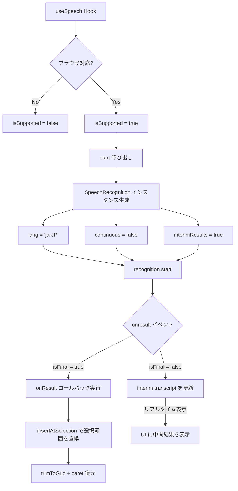
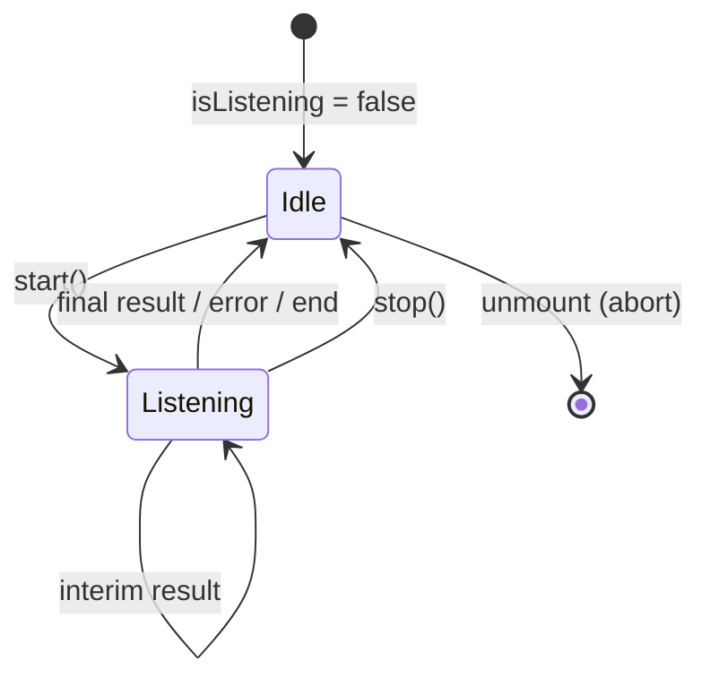
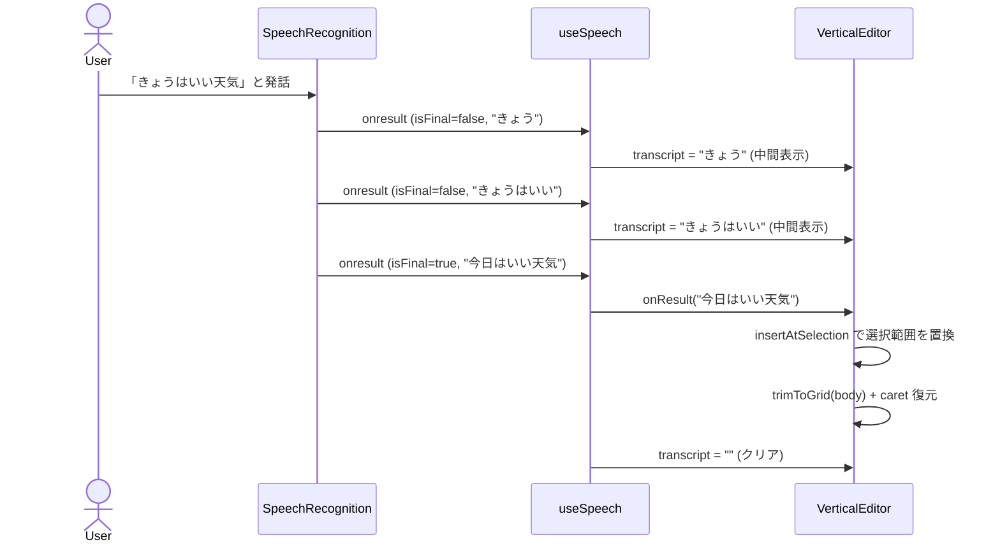

# Speech Input

## Overview

Web Speech API を利用した音声入力機能。ブラウザのネイティブ音声認識を使い、日本語の音声をリアルタイムでテキスト化してエディタに流し込む。

## 対応ブラウザ

`SpeechRecognition` または `webkitSpeechRecognition` が存在するブラウザのみ表示。非対応ブラウザではボタン自体が非表示になる。

## アーキテクチャ



## useSpeech Hook



### 返却値

| フィールド | 型 | 説明 |
|-----------|------|------|
| `isSupported` | `boolean` | ブラウザが Web Speech API に対応しているか |
| `isListening` | `boolean` | 現在録音中か |
| `transcript` | `string` | 中間認識結果（確定前のテキスト） |
| `start` | `(onResult) => void` | 録音開始。確定テキストは `onResult` で受け取る |
| `stop` | `() => void` | 録音停止 |

## SpeechRecognition の設定

| パラメータ | 値 | 理由 |
|-----------|-----|------|
| `lang` | `ja-JP` | 日本語認識 |
| `continuous` | `false` | 1回の認識を短く区切り、継続が必要なら `onend` で再開する |
| `interimResults` | `true` | 確定前のテキストもリアルタイム表示 |

## 認識結果の処理フロー



## エディタとの統合

音声入力で得たテキストは `useVerticalTextInput` が現在の選択範囲へ挿入し、`trimToGrid` を通してグリッド制約（最大400文字・最大20列）を守る。

```
handleSpeechResult(text) {
  const { text: next, caret } = insertAtSelection(...)
  setBody(next)
  requestAnimationFrame(() => textarea.setSelectionRange(caret, caret))
}
```

- 現在の選択範囲を置換
- caret は挿入テキストの直後へ戻す
- 400文字を超えた分は切り捨て
- 列数が20を超えた分も切り捨て

## UI

- **通常時**: 「音声入力」ボタン（灰色ボーダー）
- **録音中**: 「録音中...」ボタン（赤ボーダー + pulse アニメーション）
- **中間結果**: ボタン下にリアルタイムでテキスト表示（色: `#888`）

```css
@keyframes pulse {
  0%, 100% { opacity: 1; }
  50% { opacity: 0.6; }
}
```

## クリーンアップ

- コンポーネントのアンマウント時に `recognition.abort()` で強制停止
- `useEffect` の cleanup で実行
- `stop()` 呼び出し時は `recognition.stop()` + ref を null に

## 型定義

ブラウザの Web Speech API は TypeScript に標準の型定義がないため、`app/global.d.ts` でカスタム型を宣言:

- `SpeechRecognition`
- `SpeechRecognitionEvent`
- `SpeechRecognitionResult`
- `SpeechRecognitionAlternative`
- `Window` の拡張 (`SpeechRecognition`, `webkitSpeechRecognition`)

## 関連ファイル

| ファイル | 役割 |
|---------|------|
| `app/lib/use-speech.ts` | useSpeech Hook |
| `app/lib/use-vertical-text-input.ts` | 認識結果の挿入、グリッド制約、caret 復元 |
| `app/lib/grid.ts` | `trimToGrid` / `insertAtSelection` |
| `app/global.d.ts` | Web Speech API の型定義 |
| `app/islands/vertical-editor.tsx` | Hook の利用・UI |
| `app/styles/global.css` | pulse アニメーション |
