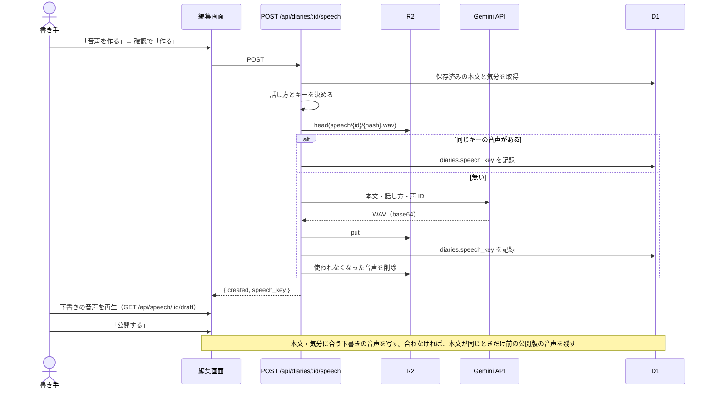

# Speech Output（日記の読み上げ）

## Overview

日記を、書き手本人の声（Gemini API の音声複製で登録済みの声）で読み上げて聞けるようにする。音声は書き手が編集画面で作って管理する。

1. 編集画面で「音声を作る」を押し、確認で「作る」を選ぶと、保存済みの本文から音声が作られる。話し方は日記の気分から自動で決まる。
2. 書き手は編集画面で、作った音声をその場で聞いて確かめられる。
3. 「訪問者も声で聞ける」をオンにして公開すると、公開ページで誰でも聞ける。
4. オフにして公開し直すと、公開ページでは誰も聞けなくなる（ログイン中でも「声で聞く」は出ない）。書き手は編集画面のプレーヤーで聞ける。
5. 「音声を削除」で音声そのものを消せる。公開ページからもすぐに消える。

公開ページに音声が出るか、どの音声が出るかは、操作の順番と本文・気分の変更の有無で変わる。操作ごとの結果は [操作ごとの公開ページの音声](#操作ごとの公開ページの音声) にまとめた。

生成は書き手の操作だけで起きる。訪問者の操作や公開では生成しない。音声入力（Web Speech API）については [Speech Input](./speech-input.md) を参照。



## データモデル

| テーブル | 列 | 意味 |
|---|---|---|
| `diaries` | `speech_key TEXT`（NULL 可） | 下書き側の音声の R2 キー。最後に作った音声を指す |
| `diaries` | `speech_public INTEGER NOT NULL DEFAULT 0` | 訪問者も聞けるか（下書き側の設定） |
| `diary_snapshots` | `speech_key TEXT`（NULL 可） | 公開中の音声の R2 キー |
| `diary_snapshots` | `speech_public INTEGER NOT NULL DEFAULT 0` | 公開時点の「訪問者も聞ける」 |

- 既存の日記も新しい日記も `speech_public = 0`（オフ）で始まる。
- `speech_public` は背景色や気分と同じく、編集画面で切り替えて保存し、公開したときにスナップショットへ写す。一覧の「未公開の変更」の判定にも含める。
- `speech_key` は保存 API（`PUT /api/diaries/:id`）からは書き換えられない。生成・削除 API だけが書く。

## 話し方（気分から自動）

話し方の指示文は、保存済みの日記の気分（`diaries.mood`）から決める。すべて「日記を読み聞かせるように、」で始め、その後に次の文を続ける。

| 気分 | キー | 続ける文 |
|---|---|---|
| 嬉しい | `happy` | 明るく弾んだ声で |
| 楽しい | `fun` | 楽しそうに、はずむように |
| 穏やか | `calm` | 落ち着いて、やわらかく |
| 悲しい | `sad` | 静かに、少しゆっくり、悲しそうに |
| 怒り | `angry` | 少し強い口調で、感情を込めて |
| 不安 | `anxious` | 不安そうに、ためらいがちに |
| なし・不明 | `null` など | 落ち着いて自然なペースで |

- 対応表は `app/lib/speech-style.ts` に置き、`MoodKey` で網羅する（気分を増やすと型エラーで気付ける）。
- 確認ダイアログには、使う話し方と元になった気分を出す（例:「話し方: 明るく弾んだ声で（気分「嬉しい」から）」）。
- 話し方の指示文はキーの入力に含まれるので、気分を変えて保存すると、それまでの音声は「古い」扱いになる。本文が同じなら、作り直すまでは公開ページに前の話し方の音声が残る（[公開時の引き継ぎ](#公開時の引き継ぎ)）。

## キーの設計（R2）

- 形式は `speech/{diaryId}/{sha256}.wav`。
- ハッシュの入力は、モデル、話し方の指示文、声 ID、音声形式（mime と sample rate）、本文。区切り文字の衝突で別の入力が同じキーにならないよう、`JSON.stringify` した配列をハッシュする。
- 同じ本文・話し方・声・形式なら同じキーになる。同じキーの音声が R2 にあれば、「音声を作る」は Gemini を呼ばずにそれを使う。
- 「音声が今の日記に合っているか」は、`diaries.speech_key` と、保存済みの本文と気分から計算したキー（期待キー）の一致で判定する。本文・気分・声 ID・形式のどれかが変わると一致しなくなる。
- 声 ID はハッシュの入力に使うだけで、キー・URL・ログ・画面には出さない。編集画面には判定の結果（合っているか）だけを渡す。
- 画像配信ルート（`/api/images/...`）は `diaries/` で始まるキーだけを返すため、`speech/` 配下は露出しない。

## API

| ルート | 認証 | 役割 |
|---|---|---|
| `POST /api/diaries/:id/speech` | 必須 | 保存済みの本文と気分から音声を作り、`diaries.speech_key` に記録する |
| `DELETE /api/diaries/:id/speech` | 必須 | その日記の音声をすべて削除し、`diaries.speech_key` とスナップショットの `speech_key` を NULL にする（`diaries.updated_at` も更新する） |
| `GET /api/speech/:id` | 不要 | 公開中スナップショットの音声。`speech_public = 1` なら誰でも聞ける。0 なら認証の有無にかかわらず 404（公開ページにボタンを出さないのと揃える。書き手は下書きの配信 API で聞く） |
| `GET /api/speech/:id/draft` | 必須 | `diaries.speech_key` の音声 |

### 生成（`POST /api/diaries/:id/speech`）

| 順 | 条件 | 応答 |
|---|---|---|
| 1 | 未認証 | 401 |
| 2 | 日記が無い | 404 |
| 3 | 保存済みの本文が空（trim 後） | 422 |
| 4 | 本文が 400 字を超える | 422 |
| 5 | `GEMINI_API_KEY` か `GEMINI_VOICE_ID` が未設定 | 503 |
| 6 | 同じキーの音声が R2 にある | Gemini を呼ばず `speech_key` を記録して 200（`{ created: false }`） |
| 7 | Gemini が HTTP エラー・音声なし・WAV として不正・通信失敗 | 502（R2 にも D1 にも書かない） |
| 8 | Gemini がタイムアウト（90 秒） | 504（同上） |
| 9 | 生成成功 | R2 に保存し、`speech_key` を記録し、使われなくなった音声を消して 200（`{ created: true }`） |
| 10 | 6・9 で記録するとき、`diaries.updated_at` が生成開始時から変わっている | 記録せず 409。9 で put した音声は、どこからも参照されていなければ R2 から消す |

- 生成は数十秒かかり得る（目安として、約 11 秒の音声で生成 API の応答が約 8 秒。ローカルでの実測）。応答はその間待たせ、同じ処理を `waitUntil()` にも渡して、画面を離れても R2 と D1 への記録まで進める。
- 生成中に本文の保存や「音声を削除」があると `updated_at` が進む（音声の削除も `updated_at` を更新する）。そのときは古い本文の音声を記録したり、削除した音声を復活させたりしないよう、記録しない。音声の削除は `updated_at` をミリ秒まで書く。保存・公開が書く `datetime('now')` は秒単位なので、そのままでは生成開始と同じ秒の削除で値が変わらず、削除した音声が記録し直され得るため。編集画面は 409 を受けたら、未保存の編集が無ければページを読み込み直して最新の状態に合わせ、あれば保存して読み込み直すよう案内する。
- 同時に 2 回押された場合の重複生成は許容する（同じキーへの put は同じ内容の上書きになる）。画面は生成中にボタンを無効にする。

### Gemini の呼び出し

- モデル `gemini-3.8-flash-tts`、`POST https://generativelanguage.googleapis.com/v1beta/interactions`、ヘッダ `x-goog-api-key`。
- `response_format` は `{ type: 'audio', mime_type: 'audio/wav', sample_rate: 24000 }`、声は `generation_config.speech_config[].voice`、話し方は本文の `annotations`（`speech_metadata` の `style`）で渡す。本文だけを読み、日付は読まない。
- API は現在 24kHz 固定で、`sample_rate` に 16000 などを指定しても 24kHz / mono / 16bit で返る（2026-09 時点の実測）。実際に返る形式に合わせて 24000 を送り、キャッシュキーにも含める。
- 応答の `steps[]` のうち `model_output` の `content[]` で最後の `audio` の `data` を base64 復号する。`Uint8Array.fromBase64` があればそれを使い、無ければ `atob` とループで戻す。
- 先頭が `RIFF` で 8 バイト目から `WAVE` でないもの、ヘッダ（44 バイト）より短いものは不正として扱う。

### 配信（`GET /api/speech/:id`、`GET /api/speech/:id/draft`）

- 配信は生成しない。Gemini を呼ばない。HEAD も同じ条件でヘッダだけを返す。
- キーが無い、または R2 に実体が無いときは 404。
- `Content-Type: audio/wav`、`Accept-Ranges: bytes`。Safari / iOS は `Range: bytes=0-1` の確認から始め、206 が返らないと再生しないことがあるため Range に応える。単一範囲の `a-b`・`a-`・`-n` を扱い、複数範囲は無視して 200 で全体を返す。範囲外は 416（`Content-Range: bytes */size`）。
- `Cache-Control` は、公開版が `no-cache`（非公開化・削除がすぐ効くようにする）、下書きが `private, no-store`。

## 公開時の引き継ぎ

- 公開（`publishDiary`）は `diaries.speech_public` をスナップショットへ写す。
- スナップショットの `speech_key` は次の順で決める。
  1. `diaries.speech_key` が期待キーと一致する → 下書きの音声を写す。
  2. 1 に当たらず、直前の公開版（`diaries.published_snapshot_id` が指すスナップショット）があり、その本文が今回公開する本文と完全に同じで、その `speech_key` が NULL でない → 直前の公開版の音声を引き継ぐ。
  3. それ以外 → NULL。
- 2 は、気分だけを変えた場合や、声 ID を差し替えた場合に当たる。下書きの音声は「古い」扱いになるが、本文が同じなら前の話し方・声の音声でも読む内容は正しいので、作り直して公開し直すまでは公開ページに前の音声を残す。
- 本文が変わった場合は、内容の違う古い音声を公開しないよう NULL にする。初めての公開で下書きの音声が古い場合も NULL。
- 声 ID が未設定で期待キーを計算できないときは 1 に当たらないが、2 と 3 はそのまま適用する。
- 2 で引き継いだ音声は新しい公開中スナップショットの音声になるので、次の「使われなくなった音声の削除」で消えない。

## 操作ごとの公開ページの音声

公開ページに出る音声は、公開したときにスナップショットへ写したものだけで決まる。音声を作る・作り直す・保存するだけでは公開ページは変わらず、変わるのは公開したときと、音声を削除したときだけ。どの音声が写るかは、下書きの音声が保存済みの本文と気分に合っているかと、本文が前の公開版と同じかで決まる（[公開時の引き継ぎ](#公開時の引き継ぎ)）。

次の表は、日記が公開済みで「訪問者も声で聞ける」がオンの状態から操作した結果（「未公開の日記」の行を除く）。公開ページの音声はログインの有無で変わらない。「声で聞く」が出ないときは、音声の URL（`/api/speech/:id`）も誰に対しても 404 を返す。

| 操作 | 公開ページ（訪問者） | 公開ページ（ログイン中） | 編集画面の表示 |
|---|---|---|---|
| 音声を作る → 公開する | 作った音声が流れる | 同左 | 作った直後は「公開ページに反映するには「公開する」を押してください」（公開済みの日記のときだけ）。公開すると案内が消える |
| 公開する → 音声を作る | まだ出ない（前の公開版に音声があれば、その音声のまま）。もう一度公開すると作った音声が出る | 同左 | 「公開ページに反映するには「公開する」を押してください」。もう一度公開すると消える |
| 気分だけ変えて保存・公開（作り直さない） | 本文が同じなので、前の公開版の音声（前の話し方）が流れ続ける。前の公開版に音声が無ければ出ない | 同左 | 「本文や気分が変わったため、音声が古くなっています」と「音声を作り直す」。「公開する」の案内は出ない |
| 本文を変えて保存・公開（作り直さない） | 「声で聞く」は出ない（内容の違う音声を公開しない） | 同左 | 気分だけ変えたときと同じ。下書きの古い音声は、編集画面のプレーヤーでは聞ける |
| 作り直して公開 | 新しい音声が流れる。作り直してから公開するまでは、前の公開版の音声（あれば）のまま | 同左 | 作り直した直後は「公開する」の案内。公開すると消える |
| 「訪問者も声で聞ける」をオフにして公開 | 「声で聞く」は出ない | 同左（ログイン中でも出ない） | スイッチがオフになるだけで、音声の案内は変わらない。書き手は編集画面のプレーヤーで聞く。オンに戻して公開すると公開ページにまた出る |
| 音声を削除 | 公開し直さなくても、すぐに「声で聞く」が消える | 同左 | 下書きの音声も消え、「音声を作る」だけになる（設定があるとき） |
| 声 ID を登録し直す（再デプロイ後） | 公開中の音声（前の声）がそのまま流れる。作り直す前に公開し直しても、本文が同じなら前の声のまま | 同左 | 開くと「本文や気分が変わったため、音声が古くなっています」と「音声を作り直す」。作り直すと新しい声になり「公開する」の案内が出て、公開すると公開ページも新しい声になる |
| 未公開の日記 | 公開ページが無い（「日記が見つかりません」） | 同左 | 編集画面のプレーヤーでだけ聞ける。「公開する」の案内は出ない |

- 保存だけでは公開ページは変わらない。本文・気分・「訪問者も声で聞ける」を変えて保存しても、公開するまでは前の公開版の本文と音声のまま。
- 気分や声 ID だけを変えたときに前の音声を残すのは、話し方や声が前のままでも読む内容は正しいから。本文を変えたときに消すのは、公開ページの本文と違う内容を読ませないため。
- 「公開する」の案内は、公開すれば下書きの音声が公開版に写る（音声が今の日記に合っていて、未保存の変更が無い）のに、まだ写っていないときだけ出す（[編集画面](#編集画面editid)）。

### 音声ファイルがいつ消えるか

1 つの日記について R2 に残す音声は、「下書きの音声」（`diaries.speech_key`）と「公開中の音声」（公開中スナップショットの `speech_key`）の最大 2 つ。両者が同じ音声なら 1 つになる。

- 作り直したとき: 新しい音声が下書きの音声になり、下書きにしか無かった古い音声はその時点で消える。公開中の音声は、次に公開して切り替わるまで残る（その間、公開ページでは前の音声が流れ続ける）。
- 公開したとき: 公開版が切り替わり、下書きと新しい公開版のどちらからも参照されなくなった音声が消える。本文を変えて公開し、公開版の音声が無くなったときも、前の公開版の音声はここで消える（下書きの古い音声は残る）。
- 保存したとき: 消さない。下書きの音声は古くなっても参照されたままなので、次の生成か公開まで残る。
- 音声を削除したとき・日記を削除したとき: その日記の音声（`speech/{diaryId}/` 配下）をすぐに全部消す。
- 過去のスナップショット（公開履歴）が指していた音声は残さない。公開ページは最新の公開版だけを使い、過去の公開版の音声を聞く手段が無いため。過去のスナップショットの `speech_key` には、R2 から消えた音声のキーが残ることがある。

2 つを超えて残るのは、生成した音声を記録してから掃除するまでの間と、掃除（R2 の削除）が失敗したときだけ。失敗して残った音声は、次の生成か公開のときに消える。「[費用と容量](#費用と容量)」の「下書きと公開版が別々に残る最悪」は、すべての日記でこの 2 つが別々の音声として残る場合（作り直して公開していない、など）を指す。

## 使われなくなった音声の削除

「残す音声」は、`diaries.speech_key` と公開中スナップショットの `speech_key`（最大 2 つ）。それ以外の `speech/{diaryId}/` 配下を削除する。

| 契機 | 処理 | 失敗時 |
|---|---|---|
| 生成成功後（同じキーの音声を使ったときも） | 残す音声以外を削除 | ログのみ。生成は成功とする |
| 公開 | 残す音声以外を削除 | ログのみ。公開は成功させる |
| 音声の削除（`DELETE .../speech`） | D1 の 2 つのキーを NULL にしてから、`speech/{diaryId}/` 配下を全削除 | R2 の削除失敗はログに残す（公開ページからは消える） |
| 日記削除 | 画像・OGP キャッシュと一緒に全削除 | 既存と同じくログのみ |

下書きを保存しただけでは削除しない。古い音声は、次の生成か公開のときに消える。

## 画面

### 編集画面（`/edit/:id`）

ツールバーに、下書きの音声プレーヤー、「音声を作る」「音声を作り直す」「音声を削除」、「訪問者も声で聞ける」、状態に応じた短い案内文を並べる。プレーヤー（`<audio controls>`）は再生位置を操作しやすいよう幅 280px にし、狭い画面でははみ出さないよう `max-width: 100%` で縮める。

| 状態 | 表示 |
|---|---|
| 設定（キー・声 ID）が無い | 「音声を作る」は出さない。既存の音声があれば、聞く・削除は出す |
| 設定が無く、下書きにも公開版にも音声が無い | 「訪問者も声で聞ける」も出さず、音声操作の欄ごと出さない |
| 本文か気分に未保存の変更がある | 「保存してから作ってください」と案内し、「音声を作る」を無効にする |
| 音声が無い | 「音声を作る」 |
| 音声が今の日記に合っている | 下書きの音声プレーヤー、「音声を削除」 |
| 音声が古い | 「本文や気分が変わったため、音声が古くなっています」、プレーヤー、「音声を作り直す」「音声を削除」 |
| 公開済みで、音声が今の日記に合っているが公開版の音声と異なる（公開版に音声が無いときを含む） | 「公開ページに反映するには「公開する」を押してください」 |
| 生成中 | 「作成中…（1 分ほどかかることがあります）」。ボタンは無効 |

- 「訪問者も声で聞ける」（と「公開したときに反映されます」の添え書き）は、設定があるとき、または下書きか公開版に音声があるときだけ出す。読み上げを設定していない環境では使えない項目を見せないため。設定を後から外した場合も、作成済みの音声の公開・非公開は切り替えられる。出さないときも、保存にはそれまでの値をそのまま含める。
- 「音声を作る」「音声を作り直す」は、費用（1 回あたり約 3 円）と話し方・元になった気分を確認ダイアログで見せてから実行する。「音声を削除」は、公開中の音声も消えることを確認ダイアログで伝える。
- 未保存かどうか、音声が合っているかは render 中に導出する（`app/lib/speech-editor-state.ts`）。ページを開いた時点の判定はサーバで行い、その後の保存・生成は「音声の元になった本文と気分」を覚えておいて保存済みの値と比べる。
- 下書きの音声の URL の `v` には `speech_key` 由来の値を載せ、作り直した後に古い音声を再生しない。
- 公開版の音声は公開したときにだけ変わるので、公開済みの日記で音声を作ったり作り直したりした後は、もう一度「公開する」を押すまで公開ページに反映されない。これを画面で分かるよう、公開すれば引き継がれる音声がまだ公開版に無いときに上の案内を出す。
  - 判定は render 中に導出する。ページを開いた時点の公開版の `speech_key` はサーバから渡し、公開後は公開 API（`POST /api/diaries/:id/publish`）の応答の `speech_key`（公開版に写した音声のキー。前の公開版から引き継いだ音声を含む。無ければ `null`）で置き換える。音声を削除したときは公開版の音声も消えるので、手元の公開版のキーも消す。
  - 本文か気分に未保存の変更があるときは出さない。公開は保存してから行うため、その音声は公開時に古くなり、下書きの音声としては公開版に写らない。
  - 音声が古いときも出さない。気分だけを変えて保存した場合、公開すると本文が同じ前の公開版の音声は残るが、新しい話し方の音声は作り直すまで公開版に入らない。このときは「本文や気分が変わったため、音声が古くなっています」の案内と「音声を作り直す」を出す。
  - 一覧の「未公開の変更」には音声の違いを含めない。音声が古いかどうかは声 ID を使うハッシュでしか判定できず、古い音声を差分に数えると、公開しても下書きの音声が写らないため表示が消えなくなるため。
- 「プレビュー」には「声で聞く」を出さない。下書きの音声は、プレビュー中も表示されているツールバーのプレーヤー（`/api/speech/:id/draft`）で聞く。
- 新規作成画面（`/new`）には音声の操作を出さない。

### 公開ページ（`/d/:id`）

- 公開中スナップショットに `speech_key` があり、`speech_public = 1` のときだけ、ヘッダ右側の「編集する」の手前に「声で聞く」ボタンを出す。認証の有無は条件に使わず、ログイン中も訪問者と同じ見え方にする（書き手は編集画面のプレーヤーで聞く）。`src` は `/api/speech/:id?v=<snapshot.id>`。
- 再生 island（`speech-player`）は「声で聞く」「停止」を切り替え、再生中は `aria-pressed` を true にして色を反転する。`<audio preload="none">` を DOM 内に置き、クリックのイベントハンドラ内で `play()` を呼ぶ（iOS の自動再生制限への対応）。SPA 遷移で body が差し替わると `<audio>` が DOM から外れて止まる。

## エラーとログ

- 生成の失敗は `SpeechSynthesisError`（種別 `http / no_audio / invalid_audio / timeout / network` と HTTP ステータス）にする。
- ログは `[speech]` 接頭辞で、種別とステータス（それ以外の例外は名前）だけを出す。API キー、声 ID、本文、Gemini の応答本文は出さない。
- 生成 API の失敗は画面に「音声を作れませんでした」と出し、再試行できる状態に戻す。

## 費用と容量

前提: 400 字を落ち着いて読むと約 80〜100 秒。音声は 24kHz / mono / 16bit の WAV（48KB/秒）。毎日書いて年 365 本。

| 項目 | 見積もり |
|---|---|
| 1 本の容量 | 約 3.8〜4.8MB |
| 1 年の容量（1 本につき 1 つ） | 約 1.4〜1.8GB |
| 1 年の容量（下書きと公開版が別々に残る最悪。[1 つの日記に最大 2 つ](#音声ファイルがいつ消えるか)） | 約 2.8〜3.5GB |
| R2 の無料枠 | 10GB。既存のフォント（約 23MB）と画像を含めて約 3 年で超える見込み。超過分は $0.015 / GB・月、配信は無料 |
| 1 回の生成費用 | 出力約 2,000 トークンで約 $0.018（2027-01-01 以降は約 $0.036） |
| 1 年の生成費用（1 本 1 回） | 約 $6.6（2027 年以降は約 $13） |
| 1 年の生成費用（1 本平均 5 回作り直す） | 約 $33（2027 年以降は約 $66） |

- 生成は書き手の操作だけで起きる。訪問者の操作では生成されない。
- 同じ本文・話し方・声・形式の音声がすでにあれば、Gemini を呼ばない。
- MP3 / Opus には変換しない（Gemini が出力せず、Workers での変換は費用対効果が合わない）。

### CPU 時間

100 秒分の音声（約 4.8MB）は、応答の JSON で約 6.4MB になる。ローカル（Node.js、`atob` とループで復号）の計測では、JSON の解析が 3ms 前後、復号が 8〜13ms、応答の受け取りから WAV の確認までで 13〜28ms だった。Workers の CPU 時間の上限はプランで異なるため、本番で CPU 超過（エラー 1102）が出る場合は、応答のストリーミング受信への変更を検討する。

## キーの扱い

読み上げには、Gemini API キー（`GEMINI_API_KEY`）と声 ID（`GEMINI_VOICE_ID`）の 2 つが要る。どちらも本番では Cloudflare Pages のシークレット、dev では環境変数で渡す。リポジトリ、`.dev.vars`、`wrangler.toml`、コマンド引数、画面、ログ、シェル履歴には残さない（`.dev.vars` は平文でディスクに残るため使わない）。

2 つが揃っていないと「音声を作る」が出ず、音声が無い日記では「訪問者も声で聞ける」も出ないだけで、他の機能には影響しない。読み上げを使わないなら何も設定しなくてよい。

Cloudflare Pages のシークレットは、暗号化して保存する環境変数で、本番のサーバー（Pages Functions）はここから `GEMINI_API_KEY` と `GEMINI_VOICE_ID` を読む。macOS のキーチェーンは手元の Mac の中だけの保管場所で本番のサーバーからは読めないため、同じ値を Cloudflare 側にもシークレットとして登録する（固定ラッパーは、キーチェーンの値をそのままシークレットへ写すためのもの）。

登録に使う `wrangler pages secret put <名前>` は、その名前のシークレットが無ければ作り、あれば値を上書きするコマンドで、ダッシュボードで先に変数を用意しておく必要はない。声 ID を登録し直すときも同じコマンド（固定ラッパー）で上書きできる。

登録すると、ダッシュボード（Workers & Pages → 対象のプロジェクト → 設定 → 変数とシークレット）に `GEMINI_API_KEY` と `GEMINI_VOICE_ID` の 2 つの名前が並ぶ。値は暗号化されていて表示されない。

### 準備するもの

- 有料枠（課金を有効にしたプロジェクト）の Gemini API キー。
- Google AI Studio の Voice Replication で登録した、自分の声の ID。声 ID は登録から 1 年で失効する（[声 ID が失効したとき](#声-id-が失効したとき)）。

登録先の Cloudflare Pages のプロジェクト名は、`wrangler.toml` の最上位の `name`（fork したら自分の環境に合わせて変える値）を使う。以下の `<プロジェクト名>` はこの値に読み替える。

`vite.config.ts` は、`process.env` に `GEMINI_API_KEY` と `GEMINI_VOICE_ID` が定義されているときだけ、この 2 つを dev サーバーの binding に渡す。本番ビルドには影響しない。

### macOS: キーチェーンと固定ラッパー

API キーと声 ID を macOS キーチェーンに保存し、必要なコマンドの実行時だけ子プロセスへ渡す。

| キーチェーンのサービス名 | 中身 | アカウント |
|---|---|---|
| `400-diary-gemini-api-key` | Gemini API キー | 実行ユーザー |
| `400-diary-gemini-voice-id` | 声 ID | 実行ユーザー |

固定ラッパー（`scripts/keychain/`。引数は受け取らず、実行するコマンドは固定）:

| ラッパー | 用途 |
|---|---|
| `put-pages-secret-gemini-api-key.sh` | キーチェーンから読み、`wrangler pages secret put GEMINI_API_KEY --project-name <プロジェクト名>` に標準入力で渡す。プロジェクト名は `wrangler.toml` の最上位の `name` から読み、実行前に標準エラーへ表示する。読めない・英数字とハイフン以外を含むときは止まる |
| `put-pages-secret-gemini-voice-id.sh` | 同上（`GEMINI_VOICE_ID`） |
| `dev-with-gemini.sh` | キーチェーンから読み、`pnpm run dev` の子プロセスにだけ環境変数で渡す |

#### 登録とデプロイの手順

1. キーチェーンに登録する（値はコマンドに書かず、表示される入力欄に貼り付ける）。

   ```bash
   security add-generic-password -a "$USER" -s 400-diary-gemini-api-key -w
   security add-generic-password -a "$USER" -s 400-diary-gemini-voice-id -w
   ```

2. Cloudflare Pages のシークレットに登録する（`wrangler login` 済みであること）。

   ```bash
   bash scripts/keychain/put-pages-secret-gemini-api-key.sh
   bash scripts/keychain/put-pages-secret-gemini-voice-id.sh
   ```

3. デプロイする。`pnpm run deploy` は本番 D1 の migration（`20260929_0001_add_speech.sql`）も適用する。シークレットは登録後のデプロイから有効になる。

   ```bash
   pnpm run deploy
   ```

#### ローカルで試す

```bash
pnpm run db:migrate:local
bash scripts/keychain/dev-with-gemini.sh
```

### macOS 以外・キーチェーンを使わない場合

#### 本番のシークレット

次のコマンドを実行し、表示される入力欄に値を貼り付ける（値はコマンドに書かない）。`wrangler login` 済みであること。

```bash
pnpm exec wrangler pages secret put GEMINI_API_KEY --project-name <プロジェクト名>
pnpm exec wrangler pages secret put GEMINI_VOICE_ID --project-name <プロジェクト名>
```

Cloudflare のダッシュボード（Workers & Pages → 対象のプロジェクト → 設定 → 変数とシークレット）から、「暗号化」の変数として登録してもよい。

登録後に `pnpm run deploy` で再デプロイする。シークレットは登録後のデプロイから有効になる。

#### ローカルで試す

値をファイルやシェル履歴に残さないよう、サブシェルの中で `read -rs` で受け取って export し、そのまま `pnpm run dev` を exec する（bash / zsh で動く）。入力は画面に表示されず、値はこの dev サーバーのプロセスにだけ渡る。

```bash
pnpm run db:migrate:local
( printf 'GEMINI_API_KEY: '; read -rs GEMINI_API_KEY; echo; printf 'GEMINI_VOICE_ID: '; read -rs GEMINI_VOICE_ID; echo; export GEMINI_API_KEY GEMINI_VOICE_ID; exec pnpm run dev )
```

### 生成にかかる費用

dev でも本番でも、「音声を作る」を押すと、本文・話し方の指示文・声 ID・モデル名が Gemini に送られ、費用がかかる。

## 声 ID が失効したとき

声 ID が失効すると Gemini がエラーを返し、生成 API は 502（画面は「音声を作れませんでした」、ログは `[speech] synthesis failed: http <ステータス>`）になる。次の順で復旧する。

1. Google AI Studio の Voice Replication で声を登録し直し、新しい声 ID を得る。
2. シークレットを登録し直す。
   - macOS: キーチェーンの値を更新し（`-U` で既存の項目を上書きする）、固定ラッパーで登録する。

     ```bash
     security add-generic-password -U -a "$USER" -s 400-diary-gemini-voice-id -w
     bash scripts/keychain/put-pages-secret-gemini-voice-id.sh
     ```

   - それ以外: `pnpm exec wrangler pages secret put GEMINI_VOICE_ID --project-name <プロジェクト名>` か、ダッシュボードで値を上書きする。

3. 再デプロイする（`pnpm run deploy`）。

声 ID を差し替えると期待キーが変わるので、既存の音声は編集画面で「古い」表示になる。公開済みの音声はそのまま聞ける。作り直す前に公開し直しても、本文が同じなら前の声の音声が公開版に残る（本文を変えて公開すると公開版の音声は無くなる）。

## 予算アラート

Gemini API の費用が想定を超えたときに気付けるよう、Google Cloud 側で予算アラートを設定する。

1. Google Cloud コンソールで、Gemini API キーを発行したプロジェクトの請求先アカウントを開く。
2. 「予算とアラート」から予算を作成し、対象をそのプロジェクト（必要ならサービスを Gemini API に絞る）にする。
3. 月の予算額（例: 上の見積もりの数倍）と、通知のしきい値（例: 50% / 90% / 100%）を設定し、通知先のメールを確認する。

予算アラートは通知だけで、利用は止まらない。生成は書き手の操作だけで起きるので、通知を受けたら作り直しの回数を見直す。

## 戻すとき

PR を revert して再デプロイする。追加した列は残っても既存機能に影響しない。シークレットを外すと「音声を作る」だけが消え、作成済みの音声は聞ける。

## 関連ファイル

| ファイル | 役割 |
|---|---|
| `db/migrations/20260929_0001_add_speech.sql` | 音声のキーと公開可否の列を追加 |
| `app/lib/speech.ts` | キー、Gemini 呼び出し、WAV の確認、音声の削除、ログ |
| `app/lib/speech-style.ts` | 気分と話し方の対応表 |
| `app/lib/speech-cleanup.ts` | 使われなくなった音声の削除 |
| `app/lib/speech-response.ts` | Range 対応の音声配信 |
| `app/lib/http-range.ts` | Range ヘッダの解釈 |
| `app/lib/speech-editor-state.ts` | 編集画面の音声操作の表示の導出 |
| `app/routes/api/diaries/[id]/speech.ts` | 生成・削除 API |
| `app/routes/api/speech/[id].ts` | 公開版の配信 API |
| `app/routes/api/speech/[id]/draft.ts` | 下書きの配信 API |
| `app/islands/speech-editor.tsx` | 編集画面の音声操作 |
| `app/islands/speech-player.tsx` | 公開ページの「声で聞く」 |
| `scripts/keychain/*.sh` | キーチェーンから値を渡す固定ラッパー |
