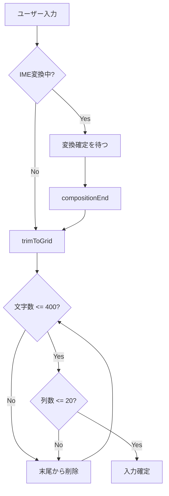
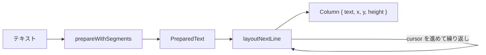
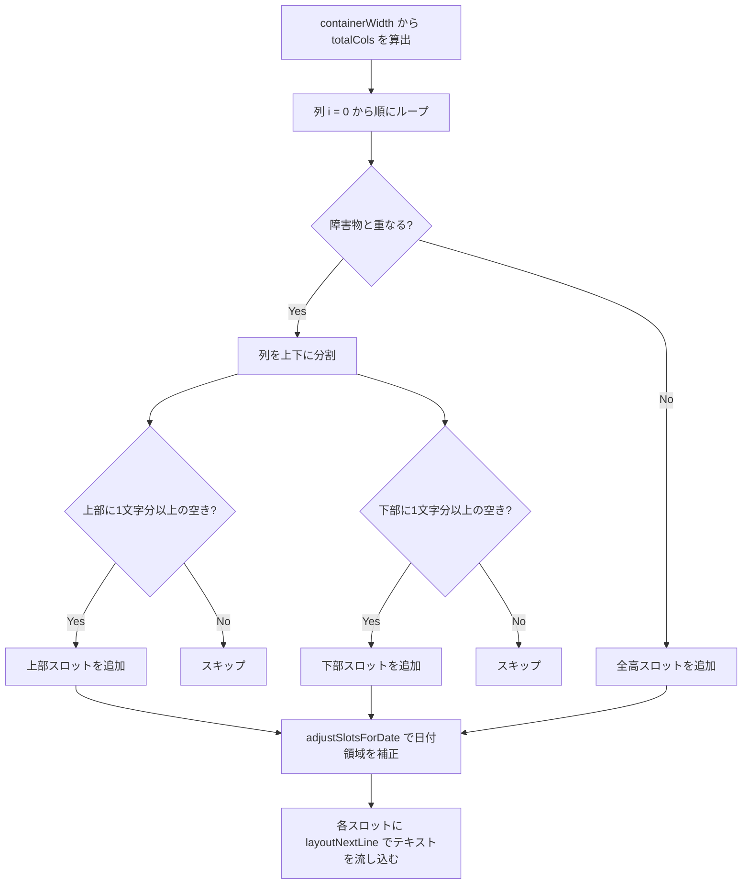

# Vertical Text Layout

## Overview

日本語の縦書きテキストを実現する2つのシステム: エディタ（CSS Grid + textarea）と表示（FlowText + pretext ライブラリ）。

## エディタ: 20x20 グリッド

### 構造

```
+--+--+--+--+--+--+--+--+--+--+--+--+--+--+--+--+--+--+--+--+
|  |  |  |  |  |  |  |  |  |  |  |  |  |  |  |  |  |  |  |  | ← 列1
+--+--+--+--+--+--+--+--+--+--+--+--+--+--+--+--+--+--+--+--+
|  |  |  |  |  |  |  |  |  |  |  |  |  |  |  |  |  |  |  |  | ← 列2
   ...                                                          ← ...
+--+--+--+--+--+--+--+--+--+--+--+--+--+--+--+--+--+--+--+--+
|  |  |  |  |  |  |  |  |  |  |  |  |  |  |  |  |  |  |  |  | ← 列20
+--+--+--+--+--+--+--+--+--+--+--+--+--+--+--+--+--+--+--+--+
← 文字は右上から左下に流れる (writing-mode: vertical-rl)
```

### パラメータ

| 定数 | 値 | 説明 |
|------|-----|------|
| `MAX_BODY_LENGTH` | 400 | 最大文字数 |
| `COLS` | 20 | 列数 (sqrt(400)) |
| `ROWS` | 20 | 行数 (sqrt(400)) |
| `CELL` | 2.0em | 1マスのサイズ |

### CSS による縦書き実現

```css
textarea {
  writing-mode: vertical-rl;   /* 縦書き・右から左 */
  width: 40em;                 /* 20列 x 2em */
  height: 41em;                /* 20行 x 2em + 1em余白 */
  line-height: 2;              /* 1マス = 2em */
  letter-spacing: 1em;         /* 列間スペース (CELL - 1em) */
}
```

### 文字数制御



## FlowText: 表示用レイアウトエンジン

### @chenglou/pretext ライブラリ

テキストを縦書き列に分割する外部ライブラリ。



- `prepareWithSegments(text, font, { whiteSpace: 'pre-wrap' })` — テキストをフォントメトリクスで解析
- `layoutNextLine(prepared, cursor, maxWidth)` — 次の列のテキストを取得（CJK禁則処理対応）

### 列計算アルゴリズム（computeSlots）

画像を障害物（obstacleRect）として扱い、各列の空きスペース（スロット）を計算する。障害物と重なる列は上下に分割される。



- `computeSlots(containerSize, fontSize, lineHeight, obstacleRect)` — 障害物を避けたスロット配列を計算
- `adjustSlotsForDate(slots, dateRect, colWidth, fontSize)` — 日付ラベル領域と重なるスロットの上部を削る

### 画像の自由配置

画像は `image_x`/`image_y` で任意の位置に配置できる。プレビュー画面ではドラッグで移動可能。

```
画像が中央付近にある場合（列が上下に分割される）:

  日付    上部テキスト
  ┌───┐  ┌─┐┌─┐┌─┐
  │4/11│  │あ││い││う│
  │(金)│  │え││お││か│  ┌──────┐
  └───┘  └─┘└─┘└─┘  │      │
                      │ 写真 │
  ┌─┐┌─┐┌─┐┌─┐┌─┐  │      │
  │き││く││け││こ││さ│  └──────┘
  │し││す││せ││そ││た│
  └─┘└─┘└─┘└─┘└─┘
    下部テキスト

  ← 右から左に列が進む
  ↕ 画像と重なる列は上下に分割される
```

- 画像はドラッグで自由に配置可能（`image_x`/`image_y` で座標を保存）
- `image_x`/`image_y` が未設定の場合は `image_layout`（left/right）からデフォルト位置を導出
- 画像サイズはスライダーまたはピンチ（指1本=移動、指2本=リサイズ）で 0.5〜1.5 倍に調整可能（`image_scale` で保存、null は 1.0 扱い）。倍率変更時は `useLayoutEffect` で画像を再計測し、obstacleRect → `computeSlots` の経路で回り込みが即座に組み直される
- 日付ラベルは `image_layout` の反対側に配置

## 関連ファイル

| ファイル | 役割 |
|---------|------|
| `app/lib/layout.ts` | `computeSlots` / `adjustSlotsForDate` レイアウト計算 |
| `app/lib/grid.ts` | 400字グリッド制約、選択範囲への挿入 |
| `app/lib/use-vertical-text-input.ts` | textarea 入力、IME composition、音声入力結果の挿入 |
| `app/islands/flow-text.tsx` | FlowText コンポーネント（描画 + ドラッグ） |
| `app/islands/vertical-editor.tsx` | エディタ全体の組み立て、textarea とプレビューの表示 |
| `app/lib/constants.ts` | `MAX_BODY_LENGTH = 400` |
| `app/styles/global.css` | `.editor-grid` のレスポンシブ対応 |
