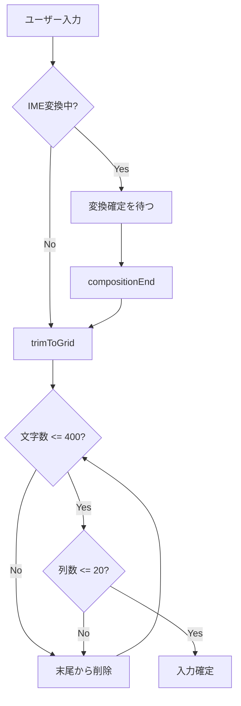
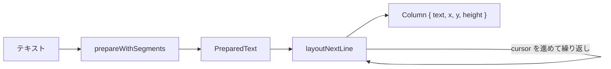
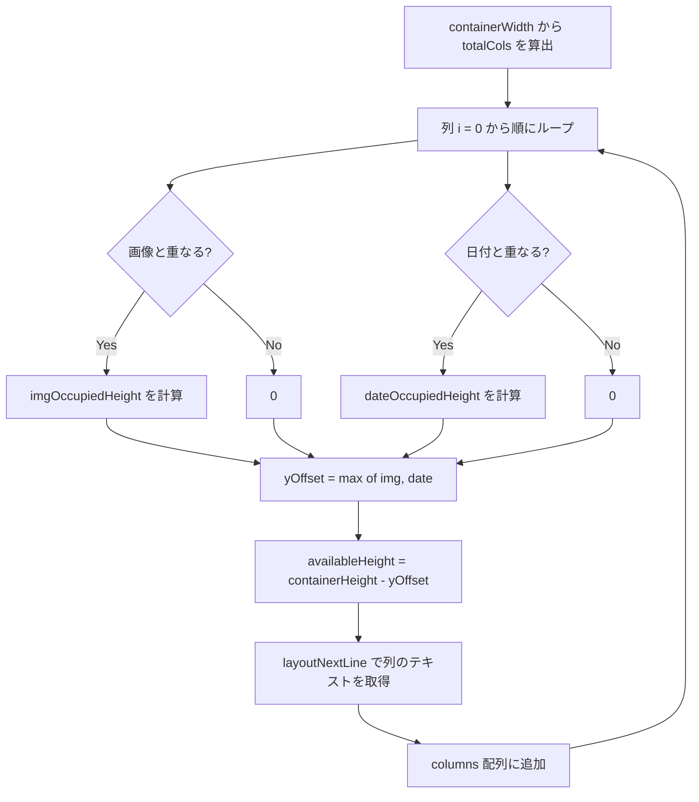

# Vertical Text Layout

## Overview

日本語の縦書きテキストを実現する2つのシステム: エディタ（CSS Grid + textarea）と表示（FlowText + pretext ライブラリ）。

## エディタ: 20x20 グリッド

### 構造

```
+--+--+--+--+--+--+--+--+--+--+--+--+--+--+--+--+--+--+--+--+
|  |  |  |  |  |  |  |  |  |  |  |  |  |  |  |  |  |  |  |  | ← 列1
+--+--+--+--+--+--+--+--+--+--+--+--+--+--+--+--+--+--+--+--+
|  |  |  |  |  |  |  |  |  |  |  |  |  |  |  |  |  |  |  |  | ← 列2
   ...                                                          ← ...
+--+--+--+--+--+--+--+--+--+--+--+--+--+--+--+--+--+--+--+--+
|  |  |  |  |  |  |  |  |  |  |  |  |  |  |  |  |  |  |  |  | ← 列20
+--+--+--+--+--+--+--+--+--+--+--+--+--+--+--+--+--+--+--+--+
← 文字は右上から左下に流れる (writing-mode: vertical-rl)
```

### パラメータ

| 定数 | 値 | 説明 |
|------|-----|------|
| `MAX_BODY_LENGTH` | 400 | 最大文字数 |
| `COLS` | 20 | 列数 (sqrt(400)) |
| `ROWS` | 20 | 行数 (sqrt(400)) |
| `CELL` | 2.0em | 1マスのサイズ |

### CSS による縦書き実現

```css
textarea {
  writing-mode: vertical-rl;   /* 縦書き・右から左 */
  width: 40em;                 /* 20列 x 2em */
  height: 41em;                /* 20行 x 2em + 1em余白 */
  line-height: 2;              /* 1マス = 2em */
  letter-spacing: 1em;         /* 列間スペース (CELL - 1em) */
}
```

### 文字数制御



## FlowText: 表示用レイアウトエンジン

### @chenglou/pretext ライブラリ

テキストを縦書き列に分割する外部ライブラリ。



- `prepareWithSegments(text, font, { whiteSpace: 'pre-wrap' })` — テキストをフォントメトリクスで解析
- `layoutNextLine(prepared, cursor, maxWidth)` — 次の列のテキストを取得（CJK禁則処理対応）

### 列計算アルゴリズム



### 画像・日付の回り込み

```
画像が右、日付が左の場合:

  日付         テキスト列          画像
  ┌───┐  ┌─┐┌─┐┌─┐┌─┐┌─┐┌─┐  ┌──────┐
  │4/11│  │あ││い││う││え││お││か│  │      │
  │(金)│  │き││く││け││こ││さ││し│  │ 写真 │
  └───┘  │す││せ││そ││た││ち││つ│  │      │
         │て││と││な││に││ぬ││ね│  └──────┘
         │の││は││ひ││ふ││へ││ほ│
         │ま││み││む││め││も││や│
         └─┘└─┘└─┘└─┘└─┘└─┘

  ← 右から左に列が進む
  ↓ 画像・日付がある列は上部の高さが制限される
```

- 画像と日付は必ず反対側に配置
- 各列で `availableHeight` を計算し、障害物がある列は短い列になる
- テキストは短い列を回避するように自然に流れる

## 関連ファイル

| ファイル | 役割 |
|---------|------|
| `app/islands/flow-text.tsx` | FlowText コンポーネント |
| `app/islands/vertical-editor.tsx` | エディタ (textarea + プレビュー) |
| `app/lib/constants.ts` | `MAX_BODY_LENGTH = 400` |
| `app/styles/global.css` | `.editor-grid` のレスポンシブ対応 |
